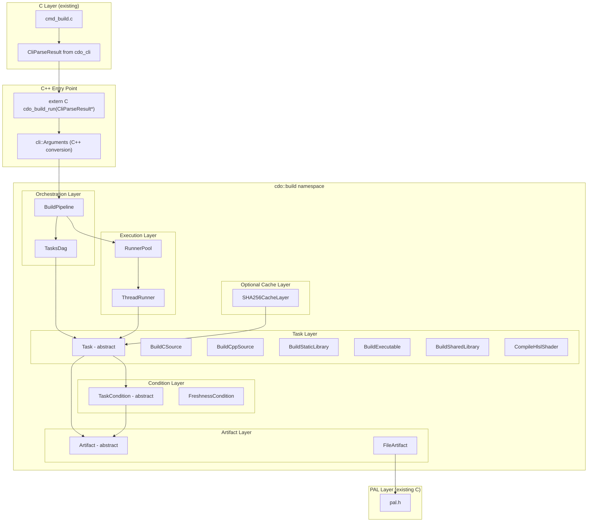
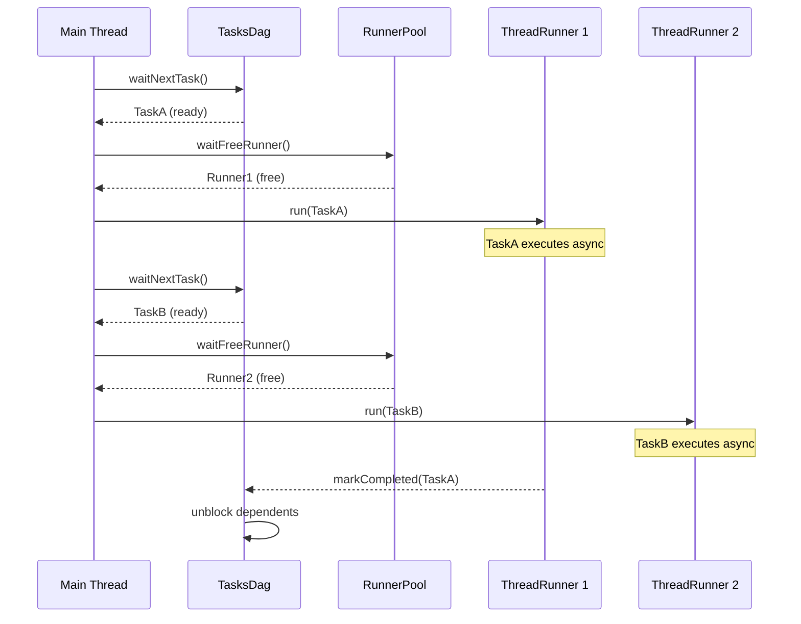
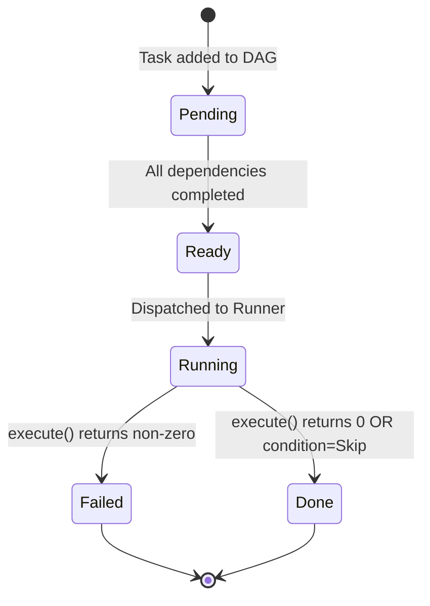

# Design Document: Build Pipeline Refactor

## Overview

This design restructures the CDo build pipeline from a C-based procedural implementation into a clean C++17 layered architecture under the `cdo::build` namespace. The new design replaces the current interleaved freshness-check logic, duplicated module-build functions, and ad-hoc scheduling with a proper OOP hierarchy:

- **Abstract interfaces**: `Runner`, `Task`, `TaskCondition`, `Artifact`
- **DAG-based scheduling**: `TasksDag` manages dependency ordering and ready-task dispatch
- **Condition-based decisions**: `FreshnessCondition` (and future conditions) determine build-or-skip per task
- **Artifact abstraction**: Type-safe wrappers around file paths with existence/mtime semantics

The existing C code calls into the new C++ layer through a single `extern "C"` entry point (`cdo_build_run`) that accepts the existing `CliParseResult*` directly from the `cdo_cli` framework. Inside the C++ layer, this is converted to a `cli::Arguments` object (under `cdo::build::cli` namespace) which provides typed, validated access to build options. This `cli::Arguments` class is designed to eventually replace the C struct when the CLI migrates to C++. The C++ implementation uses only the C++ standard library and the existing PAL layer for OS abstraction.

### Design Rationale

| Current Problem | New Solution |
|---|---|
| Duplicated freshness logic in `cmd_build_exe.c`, `cmd_build_lib.c`, etc. | Single `FreshnessCondition` class evaluated uniformly by all tasks |
| `compiler_link_is_fresh()` separate from compile freshness | Unified `TaskCondition` abstraction for all task types |
| `cache_fastpath.c`, `mtime_index.c`, `cache_threshold.c` complexity | Removed. Clean `FreshnessCondition` + optional `SHA256CacheLayer` |
| Serial-only build with global sort comparator | `TasksDag` with `waitNextTask()`/`hasActiveTask()` for parallel dispatch |
| Module-specific code paths (`cmd_build_dyn.c`, `cmd_build_shd.c`, etc.) | Generic `TasksDag` construction from workspace model |
| Raw path strings passed everywhere | `FileArtifact` objects with typed access |
| Custom C struct for entry point args | `extern "C"` accepts existing `CliParseResult*` directly, converts to C++ `cli::Arguments` |

## Architecture

### Layered Architecture



### Main Build Loop

The pipeline's dispatch loop is the core of the architecture:

```cpp
while (dag.hasActiveTask()) {
    Task* task = dag.waitNextTask();
    Runner& runner = pool.waitFreeRunner();
    runner.run(*task);
}
```

This pattern ensures:
1. Tasks execute only when all dependencies are satisfied (DAG ordering)
2. Parallelism is bounded by the runner pool size (--jobs flag)
3. The main thread is the only dispatcher — runners never poll the DAG
4. Failure propagation: when a task fails, `hasActiveTask()` returns false

### Threading Model



### File Organization

All new C++ source lives under `crates/cdo/lib/build/` with headers under `crates/cdo/api/build/`:

```
crates/cdo/api/build/
├── artifact.h          // Artifact, FileArtifact
├── build_pipeline.h    // cdo_build_run() extern "C" entry point
├── cli_arguments.h     // cli::Arguments C++ class (converts from CliParseResult)
├── condition.h         // TaskCondition, FreshnessCondition, ConditionResult
├── depfile_parser.h    // DepFileParser class
├── runner.h            // Runner, ThreadRunner, RunnerPool
├── sha256_cache.h      // SHA256CacheLayer
├── task.h              // Task base, all concrete task classes
└── tasks_dag.h         // TasksDag

crates/cdo/lib/build/
├── artifact.cpp        // FileArtifact implementation
├── build_pipeline.cpp  // BuildPipeline orchestration + extern "C" entry
├── cli_arguments.cpp   // cli::Arguments conversion from CliParseResult
├── condition.cpp       // FreshnessCondition logic
├── dag_builder.cpp     // TasksDag construction from Workspace model
├── depfile_parser.cpp  // DepFileParser implementation (GCC/Clang + MSVC)
├── runner.cpp          // ThreadRunner, RunnerPool
├── sha256_cache.cpp    // Optional SHA-256 cache layer
├── task.cpp            // Task::run() base + concrete task execute() impls
└── tasks_dag.cpp       // TasksDag waitNextTask/hasActiveTask/markCompleted
```

## Components and Interfaces

### 1. CLI Entry Point and Arguments

The `extern "C"` entry point accepts the existing `CliParseResult*` from the `cdo_cli` framework directly — no intermediate C struct is needed. Inside the C++ layer, the parse result is converted into a `cli::Arguments` object that provides typed, validated access to build-specific options.

```cpp
// api/build/build_pipeline.h
#ifndef CDO_BUILD_PIPELINE_H
#define CDO_BUILD_PIPELINE_H

#include "cmd/cli_cmd.h"  // CliParseResult from cdo_cli

#ifdef __cplusplus
extern "C" {
#endif

/// Entry point from C code into the C++ build pipeline.
/// Accepts the CliParseResult directly from the cdo_cli framework.
/// Returns 0 on success, non-zero on failure.
int cdo_build_run(const CliParseResult* result);

#ifdef __cplusplus
}
#endif

#endif // CDO_BUILD_PIPELINE_H
```

```cpp
// api/build/cli_arguments.h
namespace cdo::build::cli {

/// C++ representation of build command arguments.
/// Converts from the C CliParseResult at the boundary.
/// Designed to eventually replace the C struct when the CLI migrates to C++.
class Arguments {
public:
    /// Construct from a CliParseResult. Extracts and validates all build-specific
    /// options. Returns an error string via lastError() if conversion fails.
    explicit Arguments(const CliParseResult* result);

    bool isValid() const;
    const std::string& lastError() const;

    const std::string& workspaceRoot() const;
    const std::vector<std::string>& crateFilter() const;   // empty = all crates
    const std::string& profile() const;                     // "debug", "release", "relwithdebinfo"
    int jobs() const;                                       // 0 = auto (cpu_count)
    bool force() const;
    bool clean() const;
    bool cacheEnabled() const;
    int verbosity() const;                                  // 0=error, 1=warn, 2=info, 3=debug, 4=trace

private:
    std::string workspace_root_;
    std::vector<std::string> crate_filter_;
    std::string profile_;
    int jobs_ = 0;
    bool force_ = false;
    bool clean_ = false;
    bool cache_enabled_ = true;
    int verbosity_ = 2;
    bool valid_ = false;
    std::string error_;
};

} // namespace cdo::build::cli
```

**Conversion logic** (in `cli_arguments.cpp`):
- Extracts named args from `result->arg_values[]` by matching `long_name` against known build options (`"release"`, `"profile"`, `"jobs"`, `"no-cache"`, `"force"`, `"clean"`, `"verbose"`)
- Extracts positional crate names from `result->positional_values[]`
- Resolves workspace root via the standard discovery mechanism (walk up from cwd looking for `cdo.toml`)
- Resolves `jobs=0` to `pal_cpu_count()` at pipeline start time
- Sets `profile_` based on `--release` (shorthand for `--profile release`) or `--profile` value

### 2. Artifact Hierarchy

```cpp
// api/build/artifact.h
namespace cdo::build {

enum class ArtifactType {
    Source,
    Object,
    StaticLibrary,
    Executable,
    SharedLibrary,
    ShaderOutput,
    DepFile,
    Header,
};

class Artifact {
public:
    virtual ~Artifact() = default;
    virtual bool exists() const = 0;
    virtual uint64_t mtime() const = 0;         // nanoseconds since epoch, 0 if not found
    virtual const std::string& path() const = 0;
};

class FileArtifact : public Artifact {
public:
    explicit FileArtifact(std::string path, ArtifactType type = ArtifactType::Source);

    bool exists() const override;
    uint64_t mtime() const override;
    const std::string& path() const override;
    ArtifactType type() const;

private:
    std::string path_;
    ArtifactType type_;
};

} // namespace cdo::build
```

### 3. TaskCondition Hierarchy

```cpp
// api/build/condition.h
namespace cdo::build {

struct ConditionResult {
    enum Decision { Build, Skip };
    Decision decision;
    std::string reason;
};

class TaskCondition {
public:
    virtual ~TaskCondition() = default;

    /// Evaluate the condition against input artifacts and the primary output.
    /// The primary output is the main artifact used for freshness evaluation
    /// (e.g., the .o file for a compile task, not the .d file).
    virtual ConditionResult evaluate(const std::vector<const Artifact*>& inputs,
                                     const Artifact& primary_output) const = 0;
};

class FreshnessCondition : public TaskCondition {
public:
    explicit FreshnessCondition(bool forced = false);

    ConditionResult evaluate(const std::vector<const Artifact*>& inputs,
                             const Artifact& primary_output) const override;

private:
    bool forced_;
};

} // namespace cdo::build
```

**FreshnessCondition logic:**
1. If `primary_output.exists()` is false → `Build("does not exist")`
2. If `forced_` is true and output exists → `Build("forced")`
3. If any `input.mtime() > primary_output.mtime()` → `Build("outdated")`
4. Otherwise → `Skip("up-to-date")`

Note: The condition evaluates against the **primary output** only. Secondary outputs (like `.d` files) are produced as side effects of execution and are not considered for the freshness decision.

### 4. Task Hierarchy

```cpp
// api/build/task.h
namespace cdo::build {

class Task {
public:
    virtual ~Task() = default;

    /// Run the task: evaluate condition against primary output, then execute if needed.
    /// Returns 0 on success (built or skipped), non-zero on execute failure.
    int run();

    virtual const std::vector<const Artifact*>& inputs() const = 0;

    /// All output artifacts produced by this task. A compile task produces both
    /// the .o file and the .d dependency file, for example.
    virtual const std::vector<const Artifact*>& outputs() const = 0;

    /// The primary output artifact — used for freshness condition evaluation and logging.
    /// For compile tasks, this is the .o file. For link tasks, the binary/library.
    virtual const Artifact& primaryOutput() const = 0;

    virtual const TaskCondition& condition() const = 0;

    bool wasSkipped() const;
    int id() const;
    void setId(int id);

protected:
    /// Perform the actual build operation. Called only if condition says Build.
    virtual int execute() = 0;

private:
    int id_ = -1;
    bool skipped_ = false;
};

class BuildCSource : public Task {
public:
    struct Config {
        std::string source_path;
        std::string object_path;        // Primary output (.o)
        std::string depfile_path;       // Secondary output (.d)
        std::vector<std::string> include_paths;
        std::vector<std::string> defines;
        std::string c_standard;         // "c17"
        std::vector<std::string> extra_flags;
        bool optimize = false;
        bool debug_info = false;
        std::string compiler_path;
        int compiler_family = 0;        // CompilerFamily enum value
        std::vector<std::string> header_deps;   // from .d file
    };

    explicit BuildCSource(Config config, bool forced = false);

    const std::vector<const Artifact*>& inputs() const override;
    const std::vector<const Artifact*>& outputs() const override;
    const Artifact& primaryOutput() const override;
    const TaskCondition& condition() const override;

protected:
    int execute() override;

private:
    Config config_;
    FileArtifact source_artifact_;
    FileArtifact output_artifact_;      // .o (primary)
    FileArtifact depfile_artifact_;     // .d (secondary)
    std::vector<FileArtifact> header_artifacts_;
    std::vector<const Artifact*> inputs_cache_;
    std::vector<const Artifact*> outputs_cache_;
    FreshnessCondition condition_;
};

// BuildCppSource: identical structure to BuildCSource, uses cpp_standard
class BuildCppSource : public Task { /* ... same pattern ... */ };

class BuildStaticLibrary : public Task {
public:
    struct Config {
        std::vector<std::string> object_paths;
        std::string output_path;
        std::string archiver_path;      // ar or lib.exe
        int compiler_family = 0;
    };

    explicit BuildStaticLibrary(Config config, bool forced = false);
    // ... same interface pattern (single output, outputs() returns vector of 1) ...
};

class BuildExecutable : public Task {
public:
    struct Config {
        std::vector<std::string> object_paths;
        std::string output_path;
        std::vector<std::string> lib_paths;
        std::vector<std::string> link_libs;
        std::vector<std::string> extra_flags;
        std::string linker_path;
        int compiler_family = 0;
        bool debug_info = false;
    };

    explicit BuildExecutable(Config config, bool forced = false);
    // ... same interface pattern (single output, outputs() returns vector of 1) ...
};

class BuildSharedLibrary : public Task {
public:
    struct Config {
        std::vector<std::string> object_paths;
        std::string output_path;
        std::vector<std::string> lib_paths;
        std::vector<std::string> link_libs;
        std::vector<std::string> extra_flags;
        std::string linker_path;
        int compiler_family = 0;
    };

    explicit BuildSharedLibrary(Config config, bool forced = false);
    // ... same interface pattern (single output, outputs() returns vector of 1) ...
};

class CompileHlslShader : public Task {
public:
    struct Config {
        std::string source_path;
        std::string output_path;
        std::string dxc_path;
        std::string entry_point;
        std::string target_profile;     // e.g., "vs_6_0", "ps_6_0"
        std::vector<std::string> extra_flags;
    };

    explicit CompileHlslShader(Config config, bool forced = false);
    // ... same interface pattern (single output, outputs() returns vector of 1) ...
};

} // namespace cdo::build
```

**Multi-output design notes:**
- `outputs()` returns ALL artifacts the task produces. For `BuildCSource`/`BuildCppSource`, this includes both the `.o` (object) and `.d` (dependency) file.
- `primaryOutput()` identifies the single artifact used for: freshness condition evaluation, INFO/DEBUG logging, cache key computation, and dependency graph tracking.
- Link tasks (`BuildStaticLibrary`, `BuildExecutable`, `BuildSharedLibrary`) and `CompileHlslShader` produce a single output, so `outputs()` returns a vector of size 1 and `primaryOutput()` returns that same artifact.
- The `.d` file is still treated as an output artifact (tracked, cleaned on `--clean`), but does not participate in freshness evaluation because it is a build metadata side-effect.

### 5. TasksDag

```cpp
// api/build/tasks_dag.h
namespace cdo::build {

class TasksDag {
public:
    TasksDag();
    ~TasksDag();

    /// Add a task to the DAG. Returns the assigned task ID.
    int addTask(std::unique_ptr<Task> task);

    /// Add a dependency edge: `dependent` depends on `dependency`.
    void addDependency(int dependent_id, int dependency_id);

    /// Finalize the DAG: compute reverse edges, validate acyclicity, seed ready set.
    /// Must be called after all tasks/edges are added, before dispatch loop.
    /// Returns 0 on success, non-zero if cycle detected.
    int finalize();

    /// Block until a ready task is available (all deps satisfied). Returns nullptr
    /// if the DAG is terminated (all done or failure).
    Task* waitNextTask();

    /// Returns true while tasks are still pending or in-flight.
    bool hasActiveTask() const;

    /// Mark a task as completed successfully. Unblocks dependents.
    void markCompleted(int task_id);

    /// Mark a task as failed. Signals termination.
    void markFailed(int task_id);

    /// Query counts for summary logging.
    int totalCount() const;
    int completedCount() const;
    int skippedCount() const;
    int failedCount() const;

private:
    struct Impl;
    std::unique_ptr<Impl> impl_;
};

} // namespace cdo::build
```

**Internal implementation notes:**
- Uses `std::mutex` + `std::condition_variable` for thread-safe ready-set management
- Maintains per-task state: `Pending`, `Ready`, `Running`, `Done`, `Failed`
- `remaining_deps` counter per task, decremented on dependency completion
- When `remaining_deps` reaches 0, task moves to ready set and condition variable is signaled

### 6. Runner and RunnerPool

```cpp
// api/build/runner.h
namespace cdo::build {

class Runner {
public:
    virtual ~Runner() = default;

    /// Dispatch a task for asynchronous execution. Returns immediately.
    virtual void run(Task& task) = 0;

    /// Check if the runner has finished its current task.
    virtual bool isIdle() const = 0;

    /// Block until the runner finishes its current task.
    virtual void wait() = 0;

    /// Get the result of the last completed task (0 = success, non-zero = failure).
    virtual int lastResult() const = 0;

    /// Get the task ID of the last completed task.
    virtual int lastTaskId() const = 0;
};

class ThreadRunner : public Runner {
public:
    ThreadRunner();
    ~ThreadRunner() override;

    void run(Task& task) override;
    bool isIdle() const override;
    void wait() override;
    int lastResult() const override;
    int lastTaskId() const override;

private:
    struct Impl;
    std::unique_ptr<Impl> impl_;
};

class RunnerPool {
public:
    explicit RunnerPool(int job_count);
    ~RunnerPool();

    /// Block until any runner finishes its task and becomes free.
    /// Returns a reference to the free runner.
    Runner& waitFreeRunner();

    /// Get the number of runners in the pool.
    int size() const;

private:
    std::vector<std::unique_ptr<ThreadRunner>> runners_;
};

} // namespace cdo::build
```

### 7. SHA256CacheLayer

```cpp
// api/build/sha256_cache.h
namespace cdo::build {

class SHA256CacheLayer {
public:
    struct Config {
        std::string cache_root;     // e.g., ".cdo/cache/objects/"
        bool enabled = false;
    };

    explicit SHA256CacheLayer(Config config);

    /// Attempt a cache lookup before execution using the task's primary output hash.
    /// Returns true if hit (primary output artifact copied from cache).
    /// Secondary outputs are NOT cached — they are regenerated on execution.
    bool tryRestore(const Task& task);

    /// Store the task's primary output in the cache after successful execution.
    void store(const Task& task);

    int hits() const;
    int misses() const;

private:
    Config config_;
    int hits_ = 0;
    int misses_ = 0;
};

} // namespace cdo::build
```

### 8. BuildPipeline Orchestrator

```cpp
// Internal to build_pipeline.cpp
namespace cdo::build {

class BuildPipeline {
public:
    explicit BuildPipeline(const cli::Arguments& args);

    /// Execute the full build pipeline. Returns 0 on success, non-zero on failure.
    int run();

private:
    int loadWorkspace();
    int buildDag();
    int dispatch();
    void printSummary();

    const cli::Arguments& args_;
    // Workspace loaded from C API via extern "C"
    // TasksDag built from workspace model
    // RunnerPool sized to args_.jobs()
};

} // namespace cdo::build
```

**Entry point implementation** (in `build_pipeline.cpp`):
```cpp
extern "C" int cdo_build_run(const CliParseResult* result) {
    cdo::build::cli::Arguments args(result);
    if (!args.isValid()) {
        cdo_log_error("build: %s", args.lastError().c_str());
        return 1;
    }
    cdo::build::BuildPipeline pipeline(args);
    return pipeline.run();
}
```

### 9. DepFileParser

```cpp
// api/build/depfile_parser.h
namespace cdo::build {

/// Parses compiler-generated dependency files (.d) to extract header dependencies.
/// Supports GCC/Clang Makefile-style format and MSVC /showIncludes output.
class DepFileParser {
public:
    /// Compiler format hint for parsing strategy selection.
    enum class Format {
        GccClang,   // Makefile-style: "target.o: dep1.h dep2.h \\\n dep3.h"
        Msvc,       // /showIncludes output: "Note: including file: <path>"
        Auto,       // Attempt GCC/Clang first, fall back to MSVC
    };

    explicit DepFileParser(Format format = Format::Auto);

    /// Parse a dependency file at the given path.
    /// Returns true on success (dependencies extracted), false on failure
    /// (file not found, unreadable, or unparseable).
    bool parse(const std::string& dep_file_path);

    /// Get the list of dependency paths extracted from the last successful parse.
    /// Returns empty vector if parse() was not called or failed.
    const std::vector<std::string>& dependencies() const;

    /// Get the target path from the dependency file (the left-hand side of the rule).
    /// Empty string if not available (e.g., MSVC format has no explicit target).
    const std::string& target() const;

    /// Get a human-readable error message if parse() returned false.
    const std::string& lastError() const;

private:
    bool parseGccClang(const std::string& content);
    bool parseMsvc(const std::string& content);
    std::string normalizePathSeparators(const std::string& path) const;
    std::string unescapePath(const std::string& raw) const;

    Format format_;
    std::vector<std::string> dependencies_;
    std::string target_;
    std::string error_;
};

} // namespace cdo::build
```

**Parsing details:**

GCC/Clang format handling:
- Parses `target.o: source.c header1.h header2.h \` with backslash-newline continuation
- Handles paths with escaped spaces (`\ ` → ` `)
- Handles paths with escaped special characters (`\#`, `\$`)
- Strips the target (left of `:`) and returns only dependencies (right of `:`)
- Ignores empty lines and comments

MSVC format handling:
- Parses `/showIncludes` output lines: `Note: including file:   C:\path\to\header.h`
- Handles localized prefixes (the "Note: including file:" text varies by locale)
- Extracts the indented path, trims whitespace
- Deduplicates paths (MSVC outputs one line per `#include` hit, including repeated includes)
- Normalizes backslashes to forward slashes for cross-platform consistency

Edge cases handled:
- Empty dependency files → success with empty dependency list
- Files with only the target and source (no headers) → success with single-element list
- Paths containing spaces (both escaped and quoted)
- Very long lines (paths > 260 characters on Windows)
- Mixed line endings (CRLF, LF)
- UTF-8 paths

## Data Models

### Task State Machine



### DAG Construction Model

For each crate in build order, the DAG builder generates:

| Module Kind | Task Type | Dependencies |
|---|---|---|
| lib/ | BuildCSource/BuildCppSource per file | None (leaf tasks) |
| lib/ | BuildStaticLibrary | All compile tasks for lib/ |
| exe/ | BuildCSource/BuildCppSource per file | lib/ link task (same crate) |
| exe/ | BuildExecutable | All compile tasks for exe/ + dep crate link tasks |
| dyn/ | BuildCSource/BuildCppSource per file | lib/ link task (same crate) |
| dyn/ | BuildSharedLibrary | All compile tasks for dyn/ + dep crate link tasks |
| tst/ | BuildCSource/BuildCppSource per file | lib/ link task (same crate) |
| tst/ | BuildExecutable | All compile tasks for tst/ + dep crate link tasks |
| shd/ | CompileHlslShader per file | None (leaf tasks) |

**Inter-crate dependencies:** If crate A depends on crate B, then A's link tasks depend on B's lib link task.

### ConditionResult Model

```cpp
struct ConditionResult {
    enum Decision { Build, Skip };
    Decision decision;
    std::string reason;     // Human-readable explanation for logging
};
```

Reason strings:
- `"does not exist"` — output artifact missing
- `"forced"` — user passed `--force` flag
- `"outdated"` — at least one input is newer than output
- `"up-to-date"` — all inputs older than output

### RunOptions Model (from CliParseResult via cli::Arguments)

```cpp
// Mapping from CliParseResult arg_values to cli::Arguments fields:
// arg "release" (bool)       → profile_ = "release" (shorthand)
// arg "profile" (string)     → profile_ (explicit override)
// arg "jobs" (int)           → jobs_ (0=auto, resolved to pal_cpu_count())
// arg "no-cache" (bool)      → cache_enabled_ = !value
// arg "force" (bool)         → force_
// arg "clean" (bool)         → clean_
// arg "verbose" (bool)       → verbosity_ = 3
// positional_values[]        → crate_filter_ (empty = all crates)
// workspace root             → discovered via cdo.toml walk-up from cwd
```


## Correctness Properties

*A property is a characteristic or behavior that should hold true across all valid executions of a system — essentially, a formal statement about what the system should do. Properties serve as the bridge between human-readable specifications and machine-verifiable correctness guarantees.*

### Property 1: FreshnessCondition Decision Correctness

*For any* set of input artifacts (with arbitrary mtime values) and one primary output artifact, `FreshnessCondition::evaluate()` SHALL return:
- `Build("does not exist")` if the primary output does not exist
- `Build("forced")` if `forced=true` and the primary output is up-to-date
- `Build("outdated")` if any input mtime is strictly greater than the primary output mtime
- `Skip("up-to-date")` otherwise (all inputs older or equal to primary output, forced=false)

**Validates: Requirements 5.2, 5.3, 5.6, 7.2**

### Property 2: Task Condition-Gated Execution

*For any* Task instance with a TaskCondition that returns `Skip`, calling `task.run()` SHALL NOT invoke `execute()` and SHALL return 0. For any Task whose condition returns `Build`, `task.run()` SHALL invoke `execute()` exactly once.

**Validates: Requirements 3.2, 5.4**

### Property 3: Task Logging Consistency

*For any* Task instance, when `run()` evaluates the condition:
- If the decision is `Build`, exactly one INFO-level log line of the form `"Building: <primary_output_path> (<reason>)"` SHALL be emitted before `execute()` is called
- If the decision is `Skip`, exactly one DEBUG-level log line of the form `"Up-to-date: <primary_output_path>"` SHALL be emitted

**Validates: Requirements 9.1, 9.2**

### Property 4: ThreadRunner Asynchronous Dispatch

*For any* Task dispatched to a ThreadRunner via `run()`, the call to `run()` SHALL return to the caller before the task's `execute()` method completes, and the task SHALL execute on a thread different from the calling thread.

**Validates: Requirements 2.1, 2.2**

### Property 5: RunnerPool Concurrency Bounds

*For any* job count N in [1, max_jobs], a `RunnerPool(N)` SHALL have exactly N runners, allow up to N tasks to execute concurrently, and `waitFreeRunner()` SHALL block when all N runners are busy until at least one completes.

**Validates: Requirements 2.3, 2.4**

### Property 6: TasksDag Dependency Ordering

*For any* DAG with tasks and dependency edges, `waitNextTask()` SHALL only return a task whose dependencies have ALL been marked as completed. Equivalently: for any dependency edge A→B, task B SHALL never be returned by `waitNextTask()` before task A is marked completed.

**Validates: Requirements 4.2, 4.6**

### Property 7: TasksDag Lifecycle Correctness

*For any* DAG:
- `hasActiveTask()` SHALL return `true` while any task is in state Pending, Ready, or Running
- `hasActiveTask()` SHALL return `false` once all tasks are in state Done or Failed
- When any task is marked as failed, `hasActiveTask()` SHALL return `false` and `waitNextTask()` SHALL unblock returning nullptr

**Validates: Requirements 4.3, 4.7**

### Property 8: TasksDag Pure Construction

*For any* workspace model, constructing a TasksDag SHALL NOT invoke any filesystem operations (no `exists()`, `mtime()`, or PAL calls). The DAG is built purely from the workspace model's declared structure.

**Validates: Requirements 4.5**

### Property 9: Dependency File Parser Round-Trip

*For any* list of file paths (with varying lengths, spaces, special characters), formatting them as a GCC/Clang `.d` file and then parsing with `parseDepFile()` SHALL recover the original list of dependency paths.

**Validates: Requirements 10.1, 10.3**

### Property 10: DAG Construction Module Coverage

*For any* workspace model containing any combination of module kinds (lib, exe, dyn, tst, shd), the DAG builder SHALL produce exactly the expected task types (compile tasks per source file, one link/archive task per linkable module, one shader task per .hlsl file) with correct dependency edges (compile→link within module, inter-crate lib→dependent link).

**Validates: Requirements 11.1**

### Property 11: Cache Hit Skips Execution

*For any* task whose output artifact hash exists in the SHA-256 cache store, `SHA256CacheLayer::tryRestore()` SHALL return true and copy the cached artifact to the output path, causing `execute()` to NOT be called.

**Validates: Requirements 8.2**

### Property 12: Cache Miss Stores Artifact

*For any* task that executes successfully with the SHA-256 cache enabled, the output artifact SHALL be stored in `.cdo/cache/objects/` keyed by its SHA-256 hash after `execute()` completes.

**Validates: Requirements 8.3**

### Property 13: No Cache Access When Disabled

*For any* build execution with `cache_enabled=false`, no file reads or writes SHALL occur in the `.cdo/cache/objects/` directory.

**Validates: Requirements 7.3, 8.4**

### Property 14: Build Summary Accuracy

*For any* completed build (all tasks terminated), the final summary log line SHALL contain counts where `built + skipped + failed = total_tasks` and each count matches the actual number of tasks in that terminal state.

**Validates: Requirements 9.5**

### Property 15: Error Logging Exactly Once

*For any* task that fails execution, exactly one ERROR-level log message SHALL be emitted containing the tool's stderr output. No other component SHALL emit an additional error message for the same operation.

**Validates: Requirements 9.3, 9.4**

### Property 16: FileArtifact PAL Consistency

*For any* file path on disk, `FileArtifact::exists()` SHALL return true if and only if `pal_path_exists(path) == PAL_OK`, and `FileArtifact::mtime()` SHALL return the same value as `pal_file_mtime(path)` reports (in nanoseconds since epoch).

**Validates: Requirements 6.2**

## Error Handling

### Task Execution Failures

| Error Scenario | Handling |
|---|---|
| Compiler returns non-zero exit code | `execute()` returns non-zero, Task logs stderr at ERROR level, DAG marks task as failed |
| Linker returns non-zero exit code | Same as compiler — logged once, DAG terminates |
| DXC shader compilation fails | Same pattern — stderr logged, task failed |
| PAL spawn fails (tool not found) | `execute()` returns non-zero with descriptive error message |

### DAG-Level Failures

| Error Scenario | Handling |
|---|---|
| Task fails | `markFailed(task_id)` → `hasActiveTask()` returns false → main loop exits |
| Cycle detected during finalize | `finalize()` returns non-zero → pipeline aborts before dispatch |
| All runners busy, waitFreeRunner blocks | Normal operation — blocks until completion, no timeout (tasks have their own timeouts via PAL) |

### Infrastructure Failures

| Error Scenario | Handling |
|---|---|
| Workspace load fails | `cdo_build_run()` returns non-zero immediately with error log |
| Build lock cannot be acquired | Entry point returns non-zero (handled by existing `cmd_build.c` lock logic) |
| Output directory creation fails | Task's `execute()` detects `pal_mkdir_p` failure, returns non-zero |
| Cache directory inaccessible | `SHA256CacheLayer` logs warning, build continues without cache |
| `.d` file malformed/unreadable | `parseDepFile()` returns empty list → FreshnessCondition treats as no headers → still checks .o existence |

### Error Propagation Strategy

1. Tasks return `int` (0 = success, non-zero = failure)
2. Runner captures the return code and exposes via `lastResult()`
3. Main loop checks result after `waitFreeRunner()` returns
4. On failure, calls `dag.markFailed(task_id)` which terminates the DAG
5. Pipeline collects final counts and prints summary

No exceptions are used. All error handling is through return codes, matching the existing PAL convention.

## Testing Strategy

### Unit Testing (Primary — targeting >90% line coverage)

Unit tests are the primary verification mechanism per the workspace dev rules. They cover:

**Artifact layer:**
- FileArtifact construction, exists(), mtime() with real temp files
- FileArtifact with non-existent paths returns correct values
- ArtifactType metadata storage and retrieval

**Condition layer:**
- FreshnessCondition with mock artifacts: all decision branches
- FreshnessCondition forced flag override
- Edge cases: empty input list, identical mtimes, zero mtime

**Task layer:**
- Task::run() with mock condition returning Skip → execute not called
- Task::run() with mock condition returning Build → execute called
- Task::run() logging verification (capture log output)
- Concrete task construction with various configs

**DAG layer:**
- TasksDag add/finalize with linear chains
- TasksDag add/finalize with diamond dependencies
- TasksDag cycle detection
- waitNextTask ordering guarantees
- markCompleted unblocks dependents
- markFailed terminates DAG
- hasActiveTask lifecycle

**Runner layer:**
- ThreadRunner dispatches to separate thread
- ThreadRunner run() returns before task completes
- RunnerPool(N) creates N runners
- RunnerPool waitFreeRunner blocks/unblocks correctly

**DepFile parser:**
- GCC format: single line, multi-line with backslash continuation
- Paths with spaces (quoted)
- MSVC /showIncludes format
- Empty/malformed files → empty result
- Round-trip: generate → format → parse → verify

**Cache layer:**
- tryRestore with cache hit → returns true, file copied
- tryRestore with cache miss → returns false
- store after successful build → file in cache
- Disabled cache → no filesystem access

**DAG builder:**
- Single crate with lib module only
- Crate with lib + exe modules (correct dependency edges)
- Multi-crate with inter-crate dependencies
- All module kinds (exe, lib, tst, e2e, dyn, shd)

### Integration Testing

Integration tests verify end-to-end behavior with real compilers:

- `cdo_build_run()` with a minimal workspace (single .c file) produces correct output
- Multi-crate workspace builds in correct dependency order
- `--force` flag causes all tasks to rebuild
- `--clean` flag deletes and recreates build directory
- Header change triggers recompilation (via .d file)
- Cache hit skips compilation on second build (when cache enabled)

### E2E Testing

E2E tests exercise the full `cdo build` command through the CLI:

- `cdo build` succeeds on workspace with all module kinds
- `cdo build --release` produces optimized artifacts
- `cdo build crate_name` builds only specified crate + transitive deps
- `cdo build --jobs 4` parallelizes correctly
- Incremental build skips up-to-date targets
- Build failure produces correct error output and non-zero exit code

### Test Configuration

- Framework: cdo_ut (existing unit test framework in workspace)
- Test files: `crates/cdo/tst/unit/build/` mirroring source structure
- Coverage target: >90% line coverage on all files in `lib/build/`
- All tests run via `./cdo.exe test cdo`
