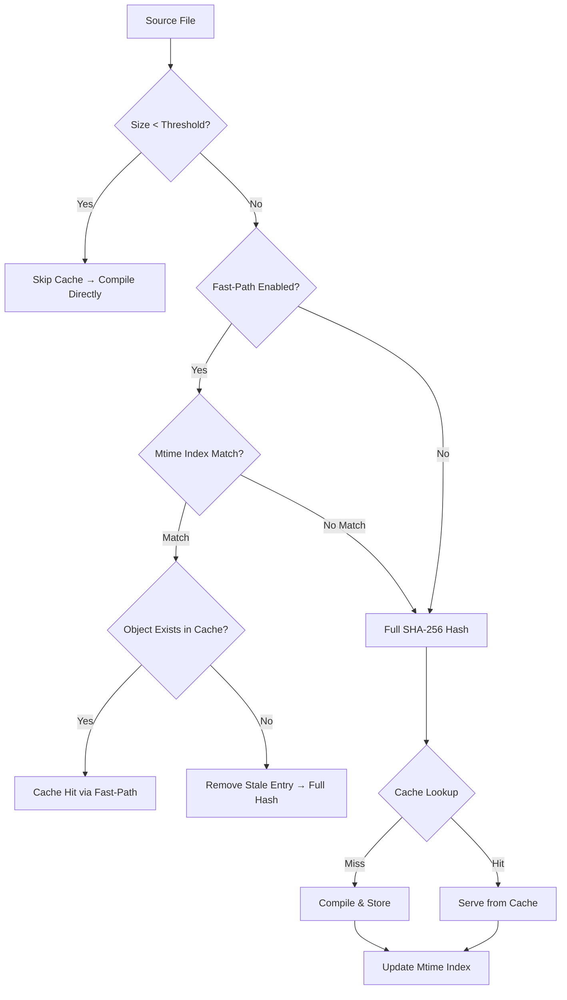
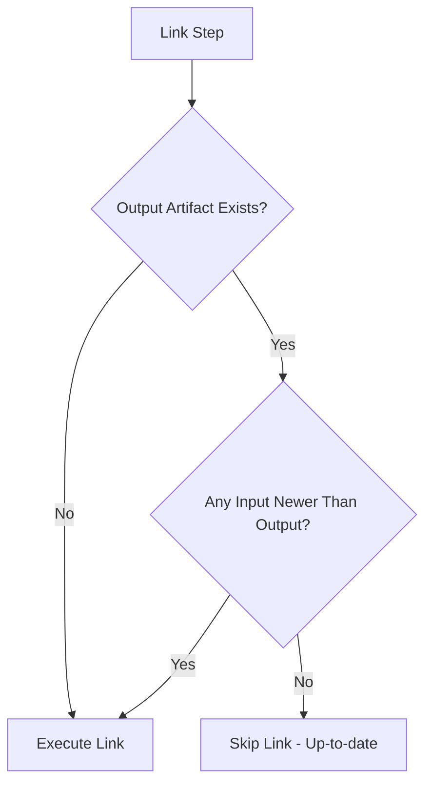
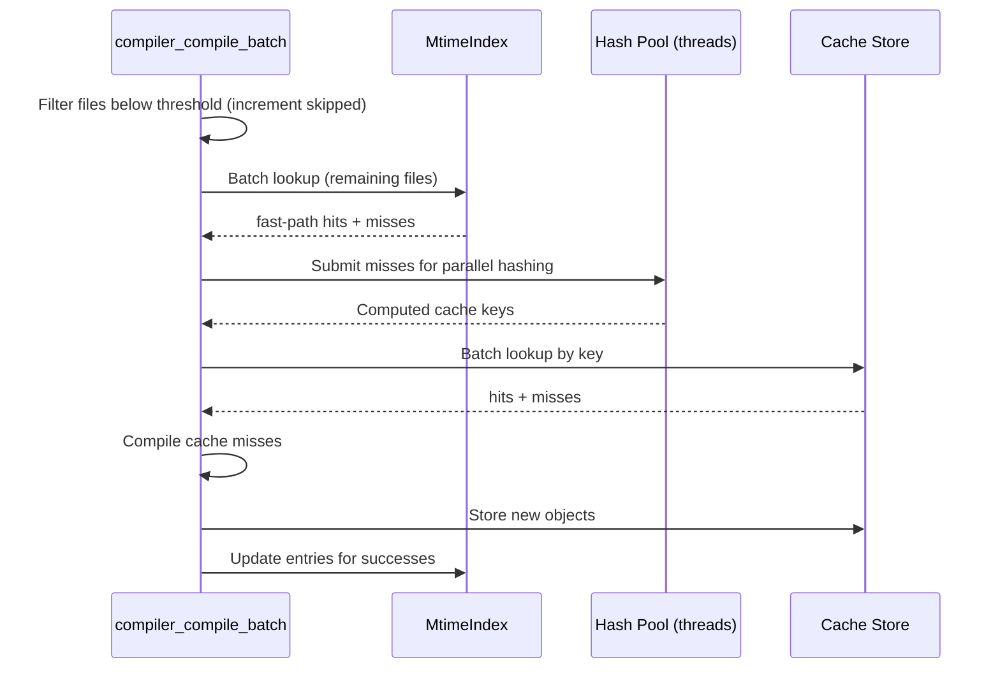

# Design Document: Cache Performance Improvements

## Overview

This design introduces three major performance optimizations to the CDo build cache pipeline, plus supporting infrastructure changes:

1. **Mtime-based fast-path validation** — Skips SHA-256 hash computation when filesystem timestamps indicate no source or header files have changed since the last successful cache interaction.
2. **Minimum filesize threshold** — Bypasses cache operations entirely for small files where hashing overhead exceeds recompilation cost.
3. **Consolidated cache logs** — Replaces noisy per-batch log messages with a single summary at build completion.
4. **Artifact link caching** — Skips re-linking when all input objects and dependency libraries are older than the output artifact.
5. **Parallel cache key computation** — Distributes SHA-256 hashing across worker threads when `--jobs N > 1`.

The design preserves backward compatibility: existing cache stores remain valid, and the new features can be individually disabled through `cdo.toml` configuration.

## Architecture

The optimizations slot into the existing cache pipeline as early-exit gates that progressively filter files before expensive operations:



For the link step:



### Component Interaction



## Components and Interfaces

### 1. MtimeIndex (`core/mtime_index.h` / `core/mtime_index.c`)

New module responsible for persisting and querying file modification timestamps.

```c
#ifndef CDO_CORE_MTIME_INDEX_H
#define CDO_CORE_MTIME_INDEX_H

#include <stdint.h>
#include <stdbool.h>

#ifdef __cplusplus
extern "C" {
#endif

/// A single entry in the mtime index.
typedef struct {
    char        path[260];      // Absolute path to source or header file
    uint64_t    mtime_ns;       // Last known mtime (nanoseconds, from PAL)
    int64_t     file_size;      // Last known file size in bytes
    char        cache_key[65];  // Associated cache key (64 hex + null)
} MtimeEntry;

/// Opaque handle to a loaded mtime index.
typedef struct MtimeIndex MtimeIndex;

/// Load the mtime index for a given profile from disk.
/// If the file doesn't exist or is corrupted, returns an empty index (not an error).
/// Returns 0 on success (including empty index), non-zero only on allocation failure.
int mtime_index_load(const char* cache_dir, const char* profile, MtimeIndex** out);

/// Look up an entry by absolute file path.
/// Returns pointer to entry if found, NULL if not found.
/// The returned pointer is valid until the next mutating operation on the index.
const MtimeEntry* mtime_index_lookup(const MtimeIndex* idx, const char* abs_path);

/// Insert or update an entry in the index.
/// Returns 0 on success.
int mtime_index_upsert(MtimeIndex* idx, const MtimeEntry* entry);

/// Remove an entry by path. No-op if not found.
void mtime_index_remove(MtimeIndex* idx, const char* abs_path);

/// Persist the index to disk using atomic write (write tmp + rename).
/// Returns 0 on success.
int mtime_index_save(const MtimeIndex* idx, const char* cache_dir, const char* profile);

/// Free all memory associated with the index.
void mtime_index_free(MtimeIndex* idx);

/// Delete the index file from disk (used by `cdo cache clear`).
int mtime_index_delete(const char* cache_dir, const char* profile);

#ifdef __cplusplus
}
#endif

#endif // CDO_CORE_MTIME_INDEX_H
```

**Implementation details:**
- Storage: hash map keyed by absolute path for O(1) lookups.
- File format: binary with a magic header + version + entry count, followed by packed entries. Zero-length or missing magic = corrupted → treat as empty.
- File location: `.cdo/cache/mtime_index_{profile}.bin` (e.g., `mtime_index_debug.bin`).
- Atomic write: write to `mtime_index_{profile}.bin.tmp`, then `rename()` over the target.

### 2. Extended CacheConfig (`model/cache_config.h`)

```c
typedef struct {
    char    path[260];          // Cache store directory (default: .cdo/cache/objects)
    int64_t max_size_bytes;     // Max cache size in bytes (default: 2GB)
    bool    enabled;            // Whether caching is active (default: true)
    char    backend[32];        // "builtin", "ccache", or "sccache"
    bool    fast_path_enabled;  // Enable mtime fast-path (default: true)
    int64_t min_file_size;      // Filesize threshold in bytes (default: 512)
} CacheConfig;
```

### 3. Extended CacheStats (`model/cache_config.h`)

```c
typedef struct {
    int     hits;
    int     misses;
    int     stored;
    int     evicted;
    int     skipped;            // Files bypassed due to filesize threshold
} CacheStats;
```

### 4. Artifact Freshness Check (`core/compiler_link.c`)

New function added before `compiler_link`:

```c
/// Check if a link artifact is up-to-date (all inputs older than output).
/// inputs[] includes object files AND dependency library paths.
/// Returns true if link can be skipped.
bool compiler_link_is_fresh(const char* output_path,
                            const char** input_paths, int input_count);
```

### 5. Parallel Hash Dispatch (integrated into `compiler_compile_batch`)

When `parallelism > 1` and cache is active, the batch function will:
1. Filter below-threshold files first (no threading needed).
2. Check the MtimeIndex for fast-path hits (read-only, single-threaded scan).
3. Submit remaining files to the existing `ThreadPool` for SHA-256 computation.
4. Collect results, partition into hit/miss sets.
5. Dispatch compilation jobs for misses.

Thread safety is achieved by:
- MtimeIndex reads are done before hash submission (single-threaded phase).
- Each hash task only reads filesystem files (no shared mutable state).
- Results are written to pre-allocated per-file slots (no contention).

### 6. Log Consolidation (changes to `compiler_compile_batch` and build command)

- Remove the existing `cdo_log_info("All %d file(s) served from cache", ...)` call.
- The build command (caller of `compiler_compile_batch`) emits one summary after all batches complete:
  ```
  Cache: 12 hit(s), 3 miss(es), 5 skipped (below threshold)
  ```
- Per-file messages remain at TRACE level for `--trace` debugging.

## Data Models

### Mtime Index Binary Format

```
Offset  Size    Field
0       4       Magic: "MTIX" (0x4D544958)
4       4       Version: 1 (uint32_t, little-endian)
8       4       Entry count (uint32_t, little-endian)
12      N*E     Entries (packed, variable-length)

Each entry:
  2 bytes   path_len (uint16_t)
  N bytes   path (UTF-8, not null-terminated)
  8 bytes   mtime_ns (uint64_t, little-endian)
  8 bytes   file_size (int64_t, little-endian)
  64 bytes  cache_key (hex ASCII, not null-terminated)
```

Total entry size: `2 + path_len + 8 + 8 + 64` bytes.

### Configuration Schema (cdo.toml)

```toml
[workspace.settings.cache]
fast-path = true          # Enable mtime-based fast-path (default: true)
min-file-size = 512       # Minimum file size for cache lookup in bytes (default: 512)
```

### Pipeline Decision Matrix

| Condition | Action |
|-----------|--------|
| `file_size < min_file_size` (and threshold != 0) | Skip cache, compile directly, increment `skipped` |
| `fast_path_enabled && mtime_index_match` && object exists | Serve from cache (fast-path hit), increment `hits` |
| `fast_path_enabled && mtime_index_match` && object missing | Remove stale entry, fall through to hash |
| `fast_path_enabled && !mtime_index_match` | Fall through to SHA-256 hash |
| `!fast_path_enabled` | Always SHA-256 hash |
| Hash → cache lookup hit | Serve from cache, update mtime index, increment `hits` |
| Hash → cache lookup miss | Compile, store in cache, update mtime index, increment `misses` → `stored` |

## Correctness Properties

*A property is a characteristic or behavior that should hold true across all valid executions of a system — essentially, a formal statement about what the system should do. Properties serve as the bridge between human-readable specifications and machine-verifiable correctness guarantees.*

### Property 1: Fast-Path Hit Returns Stored Key and Records Stats

*For any* source file whose mtime and file size exactly match its MtimeIndex entry, and whose associated cache key maps to an existing object in the Build_Cache, the fast-path SHALL return that stored cache key (skipping SHA-256 computation) and increment `CacheStats.hits` by 1.

**Validates: Requirements 1.1, 1.4**

### Property 2: Fast-Path Miss Falls Through to Full Hash

*For any* source file that either has no MtimeIndex entry, or whose mtime or file size differs from its MtimeIndex entry, the Cache_Pipeline SHALL proceed to full SHA-256 cache key computation.

**Validates: Requirements 1.2, 1.3**

### Property 3: Successful Cache Interaction Updates Mtime Index

*For any* source file and its dependency headers that participate in a successful cache store or cache hit via full hash computation, the MtimeIndex SHALL be updated with the current mtime, file size, and computed cache key for each of those files.

**Validates: Requirements 1.5**

### Property 4: Mtime Index Serialization Round-Trip

*For any* valid MtimeIndex containing arbitrary entries, serializing to the binary format and then deserializing SHALL produce an equivalent set of entries (same paths, mtimes, sizes, and cache keys).

**Validates: Requirements 1.6**

### Property 5: Stale Cache Key Cleanup

*For any* MtimeIndex entry whose cache key references an object file that does not exist in the Build_Cache, the fast-path SHALL remove that entry and fall through to full SHA-256 computation.

**Validates: Requirements 1.9**

### Property 6: Deleted File Entry Cleanup

*For any* file tracked in the MtimeIndex that no longer exists on the filesystem, a cache lookup for the associated source file SHALL treat it as a miss and remove the stale entry from the index.

**Validates: Requirements 4.4**

### Property 7: Profile-Scoped Index Isolation

*For any* two distinct build profiles, writing entries to one profile's MtimeIndex SHALL NOT affect the entries in the other profile's MtimeIndex.

**Validates: Requirements 1.11**

### Property 8: Below-Threshold Bypass

*For any* source file with size strictly less than the configured Filesize_Threshold (when threshold > 0), the Cache_Pipeline SHALL skip mtime checking, SHA-256 computation, and cache storage, and SHALL increment `CacheStats.skipped` by 1.

**Validates: Requirements 2.2, 2.3, 6.2**

### Property 9: Disabled Fast-Path Forces Full Hash

*For any* source file above the Filesize_Threshold when `fast_path_enabled` is false, the Cache_Pipeline SHALL always perform full SHA-256 hash computation without consulting the MtimeIndex.

**Validates: Requirements 5.3**

### Property 10: Failed Compilation Preserves Index

*For any* source file whose compilation fails, the MtimeIndex SHALL NOT be updated for that source file or any of its dependency headers involved in that compilation unit.

**Validates: Requirements 4.2**

### Property 11: Aggregate Cache Log Format

*For any* CacheStats where `(hits + misses + skipped) > 0`, exactly one INFO-level log message SHALL be emitted matching the format `"Cache: <hits> hit(s), <misses> miss(es), <skipped> skipped (below threshold)"`.

**Validates: Requirements 3.1, 3.2**

### Property 12: Link Freshness Check

*For any* link step where the output artifact exists on disk, the link SHALL be skipped if and only if all input object files AND all dependency library artifacts have mtime values older than or equal to the output artifact's mtime.

**Validates: Requirements 7.1, 7.2, 7.5**

### Property 13: Shader Freshness Check

*For any* shader source file whose mtime is older than its corresponding output file's mtime, shader compilation SHALL be skipped.

**Validates: Requirements 7.7**

### Property 14: Parallel vs Serial Key Equivalence

*For any* set of CacheKeyInputs, computing cache keys in parallel (across N threads) SHALL produce identical keys to computing them serially for the same inputs.

**Validates: Requirements 8.3**

### Property 15: Fast-Path Resolved Files Skip Hash Pool

*For any* file resolved via the mtime fast-path (hit), that file SHALL NOT be submitted to the parallel hash worker pool, reducing thread pool work.

**Validates: Requirements 8.6**

## Error Handling

| Scenario | Behavior |
|----------|----------|
| MtimeIndex file missing | Treat as empty index, all files fall through to hash. No error. |
| MtimeIndex file corrupted (bad magic, zero-length, truncated) | Discard silently, treat as empty. Log at DEBUG level. |
| `pal_file_mtime()` fails for a file | Treat file as changed → fall through to hash. |
| File size cannot be determined | Treat as above threshold → proceed with normal cache pipeline. |
| MtimeIndex write fails (disk full, permission denied) | Log warning, continue build. Index won't be updated this run. |
| Cache object referenced by index doesn't exist | Remove stale entry, fall through to hash. |
| Compilation fails for a file | Do NOT update index for that file's entries. |
| Invalid `min-file-size` in config (negative, non-integer, overflow) | Log warning, use default 512. |
| Invalid `fast-path` in config (non-boolean) | Log warning, use default true. |
| Thread pool creation fails for parallel hashing | Fall back to serial hash computation. Log warning. |
| Atomic rename fails during index save | Log warning. Previous index remains intact on disk. |

## Testing Strategy

### Unit Tests (example-based, targeting >90% line coverage)

Per the project's development rules (no PBT), the correctness properties above guide the unit test design but are implemented as conventional unit tests with representative examples:

- **MtimeIndex CRUD**: Create, lookup, upsert, remove entries. Verify round-trip serialization with known data.
- **MtimeIndex corruption handling**: Zero-length file, bad magic, truncated entries.
- **Fast-path logic**: Test with matching entries (hit), mismatched mtime (miss), mismatched size (miss), missing entries (miss), stale keys (cleanup + miss).
- **Filesize threshold**: Files at boundary (511, 512, 513 bytes), threshold = 0 (disabled), large threshold.
- **Configuration parsing**: Valid config, missing keys (defaults), invalid values (warnings + defaults).
- **CacheStats accumulation**: Verify hits/misses/skipped counters across multiple batches.
- **Log consolidation**: Verify single summary message format, no per-batch messages at INFO, per-file at TRACE.
- **Link freshness**: All objects older (skip), one object newer (re-link), artifact missing (always link), dependency lib newer (re-link).
- **Shader freshness**: Source older (skip), source newer (recompile), output missing (compile).
- **Profile isolation**: Write to debug index, verify release index is unaffected.
- **Parallel hash**: Verify same keys produced serially vs in parallel with identical inputs.
- **Atomic write**: Verify temp file is created and renamed, not written directly.

### Integration Tests (E2E)

- Full build cycle: first build populates index → second build with no changes uses fast-path → modify one file → third build hashes only the changed file.
- Profile switching: build debug → build release → verify each has separate index.
- `cdo cache clear`: verify index file is also deleted.
- `cdo cache stats`: verify threshold display.
- Large project simulation: verify consolidated log output (single line, not per-batch noise).

### Test Organization

```
crates/cdo/tst/unit/
  test_mtime_index.c       — MtimeIndex CRUD, serialization, corruption
  test_cache_fastpath.c    — Fast-path decision logic
  test_cache_threshold.c   — Filesize threshold behavior
  test_cache_config.c      — Configuration parsing (extended fields)
  test_cache_stats.c       — CacheStats skipped counter
  test_cache_log.c         — Log consolidation format
  test_link_freshness.c    — Artifact link freshness check
  test_shader_freshness.c  — Shader skip logic
  test_parallel_hash.c     — Serial vs parallel key equivalence
```
