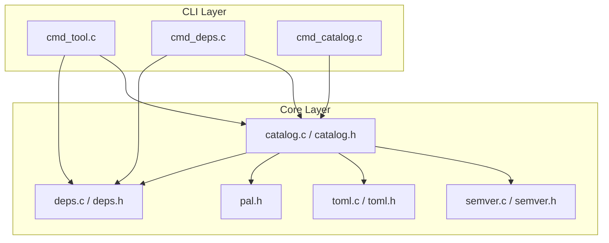

# Design Document: Catalog System

## Overview

The catalog system adds a TOML-based registry layer to CDo that maps tool and package names to platform-specific download URLs, versions, and build metadata. This eliminates the need for users to manually supply URLs during `cdo tool install` or `cdo deps add` operations.

The system is composed of two primary subsystems:

1. **Catalog Loader** — discovers, reads, parses, validates, and merges catalog TOML files from multiple locations (workspace, user-global, built-in) with a defined precedence order.
2. **Catalog Resolver** — selects the appropriate catalog entry for a given name, version constraint, and platform triple, then passes the resolved URL to the existing download pipeline.

These integrate with the existing `cmd_tool` and `cmd_deps` command handlers, and introduce a new `cmd_catalog` command for listing and searching entries.

## Architecture



**Data flow for `cdo tool install w64devkit`:**

1. `cmd_tool` detects no `--url` argument
2. Calls `catalog_load()` to discover and parse all catalog files
3. Calls `catalog_resolve_tool()` with name, version constraint, and platform triple
4. Resolver applies precedence rules and version selection
5. Returns a resolved URL (and optional checksum) to `cmd_tool`
6. `cmd_tool` passes the URL to the existing `http_download` + `archive_extract` pipeline

**Data flow for `cdo deps add sdl3`:**

1. `cmd_add` calls `catalog_load()` and `catalog_resolve_package()`
2. Resolver returns URL, include_dirs, link_libs, and defines
3. `cmd_add` populates a `DepSpec` with the resolved URL and writes build metadata to the crate manifest
4. Existing `dep_resolve()` handles the actual download and caching

## Components and Interfaces

### New Module: `src/cdo/core/catalog.h` / `catalog.c`

```c
#ifndef CDO_CORE_CATALOG_H
#define CDO_CORE_CATALOG_H

#include <stdbool.h>

#ifdef __cplusplus
extern "C" {
#endif

#define CATALOG_MAX_NAME        128
#define CATALOG_MAX_VERSION     32
#define CATALOG_MAX_DESC        512
#define CATALOG_MAX_URL         512
#define CATALOG_MAX_CHECKSUM    128
#define CATALOG_MAX_ARRAY_ITEMS 64
#define CATALOG_MAX_PLATFORMS   6

/* --- Platform Triple --- */
typedef struct {
    char os[16];        /* "windows", "linux", "macos" */
    char arch[16];      /* "x86_64", "arm64" */
    char triple[32];    /* "windows-x86_64" */
} CatalogPlatform;

/* --- Platform-specific entry --- */
typedef struct {
    char triple[32];
    char url[CATALOG_MAX_URL];
    char checksum[CATALOG_MAX_CHECKSUM]; /* "sha256:abcdef..." or empty */
} CatalogPlatformEntry;

/* --- Tool Entry --- */
typedef struct {
    char name[CATALOG_MAX_NAME];
    char version[CATALOG_MAX_VERSION];
    char description[CATALOG_MAX_DESC];
    CatalogPlatformEntry platforms[CATALOG_MAX_PLATFORMS];
    int  platform_count;
} CatalogToolEntry;

/* --- Package Entry --- */
typedef struct {
    char  name[CATALOG_MAX_NAME];
    char  version[CATALOG_MAX_VERSION];
    char  description[CATALOG_MAX_DESC];
    char* include_dirs[CATALOG_MAX_ARRAY_ITEMS];
    int   include_dir_count;
    char* link_libs[CATALOG_MAX_ARRAY_ITEMS];
    int   link_lib_count;
    char* defines[CATALOG_MAX_ARRAY_ITEMS];
    int   define_count;
    CatalogPlatformEntry platforms[CATALOG_MAX_PLATFORMS];
    int   platform_count;
} CatalogPackageEntry;

/* --- Loaded Catalog (aggregate of all sources) --- */
typedef struct {
    CatalogToolEntry*    tools;
    int                  tool_count;
    int                  tool_capacity;
    CatalogPackageEntry* packages;
    int                  package_count;
    int                  package_capacity;
} Catalog;

/* --- Resolution Result --- */
typedef struct {
    char url[CATALOG_MAX_URL];
    char checksum[CATALOG_MAX_CHECKSUM];
    char version[CATALOG_MAX_VERSION];
    /* Package-specific metadata (unused for tools) */
    char* include_dirs[CATALOG_MAX_ARRAY_ITEMS];
    int   include_dir_count;
    char* link_libs[CATALOG_MAX_ARRAY_ITEMS];
    int   link_lib_count;
    char* defines[CATALOG_MAX_ARRAY_ITEMS];
    int   define_count;
} CatalogResolveResult;

/* --- API --- */

/// Detect the current platform triple.
/// Returns 0 on success, non-zero if OS or arch is unsupported.
int catalog_detect_platform(CatalogPlatform* out);

/// Load all catalog files from the three search locations.
/// Applies precedence: workspace > user-global > built-in.
/// Returns 0 on success (even if no catalogs found — emits warning).
int catalog_load(Catalog* out, const char* workspace_root);

/// Resolve a tool by name and optional version constraint.
/// Returns 0 on success, non-zero on failure (no match, wrong platform).
int catalog_resolve_tool(const Catalog* cat, const char* name,
                         const char* version_constraint,
                         const CatalogPlatform* platform,
                         CatalogResolveResult* out);

/// Resolve a package by name and optional version constraint.
/// Returns 0 on success, non-zero on failure.
int catalog_resolve_package(const Catalog* cat, const char* name,
                            const char* version_constraint,
                            const CatalogPlatform* platform,
                            CatalogResolveResult* out);

/// Search catalog entries by query (case-insensitive substring on name/description).
/// Writes matching indices into out_indices. Returns the number of matches.
int catalog_search(const Catalog* cat, const char* query,
                   bool tools_only, bool packages_only,
                   int* out_tool_indices, int* tool_match_count,
                   int* out_pkg_indices, int* pkg_match_count);

/// Free all heap memory in a Catalog struct.
void catalog_free(Catalog* cat);

/// Free heap memory in a CatalogResolveResult (include_dirs, link_libs, defines).
void catalog_resolve_result_free(CatalogResolveResult* result);

#ifdef __cplusplus
}
#endif

#endif /* CDO_CORE_CATALOG_H */
```

### New Module: `src/cdo/core/semver.h` / `semver.c`

```c
#ifndef CDO_CORE_SEMVER_H
#define CDO_CORE_SEMVER_H

#include <stdbool.h>

#ifdef __cplusplus
extern "C" {
#endif

/* Parsed semantic version */
typedef struct {
    int  major;
    int  minor;
    int  patch;
    char prerelease[64]; /* e.g. "alpha", "beta.1" — empty if release */
} Semver;

/* Version constraint kinds */
typedef enum {
    SEMVER_EXACT,       /* 1.2.3 */
    SEMVER_CARET,       /* ^1.2.3 */
    SEMVER_TILDE,       /* ~1.2.3 */
    SEMVER_GTE,         /* >=1.2.3 */
    SEMVER_LT,          /* <2.0.0 */
    SEMVER_WILDCARD,    /* * */
} SemverConstraintKind;

typedef struct {
    SemverConstraintKind kind;
    Semver               version; /* reference version (unused for WILDCARD) */
} SemverConstraint;

/// Parse a version string "major.minor.patch[-prerelease]" into a Semver.
/// Returns 0 on success, non-zero if malformed.
int semver_parse(const char* str, Semver* out);

/// Parse a version constraint string into a SemverConstraint.
/// Supports: "1.2.3", "^1.2.3", "~1.2.3", ">=1.2.3", "<2.0.0", "*"
/// Returns 0 on success, non-zero if malformed.
int semver_constraint_parse(const char* str, SemverConstraint* out);

/// Check if a version satisfies a constraint.
/// Returns true if the version is within the acceptable range.
bool semver_satisfies(const Semver* version, const SemverConstraint* constraint);

/// Compare two versions. Returns:
///   <0 if a < b, 0 if a == b, >0 if a > b
/// Pre-release versions are lower than their release counterparts.
int semver_compare(const Semver* a, const Semver* b);

#ifdef __cplusplus
}
#endif

#endif /* CDO_CORE_SEMVER_H */
```

### New Command: `src/cdo/commands/cmd_catalog.h` / `cmd_catalog.c`

```c
#ifndef CDO_COMMANDS_CMD_CATALOG_H
#define CDO_COMMANDS_CMD_CATALOG_H

#include "core/cli.h"

#ifdef __cplusplus
extern "C" {
#endif

/// Execute the catalog command.
/// Subcommands:
///   list [--tools|--packages]  - List available catalog entries
///   search <query>             - Search entries by name/description
/// Returns 0 on success, non-zero on failure.
int cmd_catalog(const CdoOptions* opts);

#ifdef __cplusplus
}
#endif

#endif /* CDO_COMMANDS_CMD_CATALOG_H */
```

### Modified: `cmd_tool.c`

The `tool_install` function gains a new early path: if no `--url` is provided, it calls `catalog_load()` + `catalog_resolve_tool()` to obtain the URL. The existing download/extract pipeline remains unchanged.

### Modified: `cmd_deps.c` (via `cmd_add`)

`cmd_add` gains catalog integration: it calls `catalog_resolve_package()` to obtain the download URL and build metadata, then populates the `DepSpec` accordingly. A new `--dev` flag routes the dependency to `[dev-dependencies]`.

### Modified: `cli.h`

Add `CDO_CMD_CATALOG` and `CDO_CMD_DEPS` to the `CdoCommand` enum. Add a `--dev` bool and `--version` string to `CdoOptions` (or parse them from positional args like the existing tool command does).

## Data Models

### Catalog TOML Schema

```toml
# Example: catalogs/tools.toml

[[tool]]
name = "w64devkit"
version = "2.0.0"
description = "Portable C/C++ development kit for Windows"

[tool.platforms.windows-x86_64]
url = "https://github.com/skeeto/w64devkit/releases/download/v2.0.0/w64devkit-2.0.0.zip"
checksum = "sha256:abcdef1234567890..."

[[tool]]
name = "w64devkit"
version = "1.23.0"
description = "Portable C/C++ development kit for Windows"

[tool.platforms.windows-x86_64]
url = "https://github.com/skeeto/w64devkit/releases/download/v1.23.0/w64devkit-1.23.0.zip"
checksum = "sha256:fedcba0987654321..."
```

```toml
# Example: catalogs/packages.toml

[[package]]
name = "sdl3"
version = "3.2.0"
description = "Simple DirectMedia Layer 3"
include_dirs = ["include"]
link_libs = ["SDL3"]
defines = []

[package.platforms.windows-x86_64]
url = "https://github.com/libsdl-org/SDL/releases/download/release-3.2.0/SDL3-devel-3.2.0-mingw.zip"
checksum = "sha256:..."

[package.platforms.linux-x86_64]
url = "https://github.com/libsdl-org/SDL/releases/download/release-3.2.0/SDL3-3.2.0-linux-x86_64.tar.gz"
checksum = "sha256:..."
```

### Crate Manifest Schema Extension

```toml
# Existing [dependencies] section
[dependencies]
sdl3 = { version = "3.2.0", source = "catalog" }

# New [dev-dependencies] section
[dev-dependencies]
theft = { version = "0.4.5", source = "catalog" }
```

### Precedence Order (highest to lowest)

| Level | Path | Description |
|-------|------|-------------|
| 1 | `<workspace>/.cdo/catalogs/*.toml` | Workspace-local overrides |
| 2 | `~/.cdo/catalogs/*.toml` | User-global catalogs |
| 3 | `<cdo_binary_dir>/catalogs/*.toml` | Built-in catalogs |

Within a single level, files are loaded in lexicographic order. When the same name+version appears in multiple files at the same level, the lexicographically-last file wins.

### Platform Triple Values

| OS | Arch | Triple |
|----|------|--------|
| windows | x86_64 | `windows-x86_64` |
| windows | arm64 | `windows-arm64` |
| linux | x86_64 | `linux-x86_64` |
| linux | arm64 | `linux-arm64` |
| macos | x86_64 | `macos-x86_64` |
| macos | arm64 | `macos-arm64` |

### Version Constraint Grammar

```
constraint := exact | caret | tilde | gte | lt | wildcard
exact      := MAJOR "." MINOR "." PATCH ["-" PRERELEASE]
caret      := "^" exact
tilde      := "~" exact
gte        := ">=" exact
lt         := "<" exact
wildcard   := "*"
```


## Correctness Properties

*A property is a characteristic or behavior that should hold true across all valid executions of a system — essentially, a formal statement about what the system should do. Properties serve as the bridge between human-readable specifications and machine-verifiable correctness guarantees.*

### Property 1: Catalog Entry Parsing Preserves Fields

*For any* valid catalog TOML text containing a `[[tool]]` or `[[package]]` entry with randomized name (1–128 lowercase alphanumeric/hyphen/underscore chars), version (valid semver), description, platform URLs, and (for packages) include_dirs/link_libs/defines arrays, parsing the text into a `CatalogToolEntry` or `CatalogPackageEntry` SHALL produce a struct whose field values exactly match the original TOML values.

**Validates: Requirements 1.2, 1.3**

### Property 2: Platform Selection Correctness

*For any* catalog entry containing N platform sub-entries (N ≥ 1) with distinct triples, and *for any* target platform triple that matches one of the entry's platforms, the resolver SHALL return the URL and checksum from that specific platform entry and no other.

**Validates: Requirements 1.4, 3.2**

### Property 3: Invalid Entry Skipping Preserves Valid Entries

*For any* catalog file containing a mix of valid and invalid entries (entries with randomly missing required fields), the loader SHALL load all valid entries and skip all invalid entries, such that the count of loaded entries equals the count of entries with all required fields present.

**Validates: Requirements 1.6, 8.4**

### Property 4: Precedence Resolution

*For any* set of catalog entries where the same name and version appear at different precedence levels (workspace, user-global, built-in), the resolver SHALL always return the entry from the highest-precedence level, regardless of the order entries were inserted.

**Validates: Requirements 2.3**

### Property 5: Case-Insensitive Name Lookup

*For any* catalog containing an entry with name N, and *for any* query string Q that is a case-variant of N (same characters, different casing), the resolver SHALL find the entry when searching by Q.

**Validates: Requirements 3.1, 4.1**

### Property 6: Highest Version Selection

*For any* catalog containing multiple entries with the same name but different valid semver versions, when no version constraint is specified, the resolver SHALL select the entry whose version is the maximum according to `semver_compare`.

**Validates: Requirements 3.3, 4.2, 6.2**

### Property 7: Version Constraint Satisfaction

*For any* set of versions V₁..Vₙ for the same package/tool name, and *for any* valid version constraint C, the resolver SHALL either (a) return the maximum version Vᵢ such that `semver_satisfies(Vᵢ, C)` is true and no Vⱼ > Vᵢ also satisfies C, or (b) return an error if no version satisfies C.

**Validates: Requirements 3.4, 4.4, 6.1**

### Property 8: Semantic Version Comparison Total Order

*For any* three valid semantic versions a, b, c, the `semver_compare` function SHALL satisfy:
- Reflexivity: `semver_compare(a, a) == 0`
- Antisymmetry: if `semver_compare(a, b) < 0` then `semver_compare(b, a) > 0`
- Transitivity: if `semver_compare(a, b) <= 0` and `semver_compare(b, c) <= 0` then `semver_compare(a, c) <= 0`
- Pre-release ordering: for any version V, `semver_compare(V-prerelease, V) < 0`

**Validates: Requirements 6.3**

### Property 9: Version Constraint Parse Round-Trip

*For any* valid version constraint string S, parsing S into a `SemverConstraint` and then formatting back to a string SHALL produce a string that, when parsed again, yields an equivalent `SemverConstraint` (same kind and version fields).

**Validates: Requirements 6.1**

### Property 10: Intra-File Duplicate Resolution

*For any* single catalog file containing multiple entries with the same name and version but different URL values, the loader SHALL retain only the last occurrence (by file order), and the resolved URL SHALL equal the URL of the last entry.

**Validates: Requirements 8.5**

### Property 11: Catalog Search Completeness and Soundness

*For any* loaded catalog and *for any* non-empty query string Q, the search function SHALL return:
- **Soundness**: every returned entry has Q as a case-insensitive substring of its name OR description
- **Completeness**: every entry in the catalog whose name or description contains Q as a case-insensitive substring IS in the returned results

**Validates: Requirements 9.2**

### Property 12: Catalog TOML Serialization Round-Trip

*For any* valid catalog TOML document, parsing into an in-memory catalog structure, serializing back to TOML text, and parsing the result again SHALL yield a structurally equivalent catalog (same entries, same field values, same ordering of array-of-tables and key-value pairs).

**Validates: Requirements 11.1, 11.2, 11.4**

### Property 13: Checksum Validation Correctness

*For any* byte sequence B and *for any* supported hash algorithm (sha256, sha384, sha512), computing the hash of B and formatting it as `algorithm:hex_digest` SHALL produce a checksum string that passes validation when compared against itself, and SHALL fail validation when compared against any different hex digest of the same length.

**Validates: Requirements 10.1, 10.2**

### Property 14: Package Suggestion Substring Match

*For any* catalog containing N packages and *for any* query string Q that does not exactly match any package name (case-insensitive), the suggestion list SHALL contain only entries whose name includes Q as a case-insensitive substring, and the list SHALL contain at most 5 entries.

**Validates: Requirements 4.5**

## Error Handling

### Error Categories and Strategies

| Category | Strategy | User Impact |
|----------|----------|-------------|
| TOML parse failure | Skip file, report path + line + message | Other catalogs still loaded |
| Missing required fields | Skip entry, report warning | Other entries in same file still loaded |
| No matching entry | Report error + suggestions | Command fails with actionable message |
| Platform mismatch | Report error + available platforms | Command fails with actionable message |
| Invalid version constraint | Report error + supported formats | Command fails with syntax help |
| Checksum mismatch | Delete archive, report expected vs actual | Download aborted, no extraction |
| Malformed checksum format | Report error, abort entry | No download attempted |
| Filesystem I/O error | Skip file, report path + errno | Other files still loaded |
| Unsupported OS/arch | Report error, abort resolution | Catalog unusable on this platform |

### Error Propagation

- **Catalog loading errors are non-fatal** (the system degrades gracefully): individual file or entry failures produce warnings but do not prevent other catalogs from loading.
- **Resolution errors are fatal to the command**: if the resolver cannot find a matching entry or platform, the command exits with a non-zero code and an actionable error message.
- **Checksum errors are fatal to the specific entry**: the archive is deleted and the tool/package is not installed, but other operations in a batch are not affected.

### Error Message Format

All error messages follow the existing CDo output conventions using `cdo_error()`, `cdo_warn()`, and `cdo_info()`:

```
error: tool 'foobar' not found in any loaded catalog
  hint: use --url to specify a download URL manually

error: package 'sdl3' is not available for platform 'linux-arm64'
  available platforms: windows-x86_64, linux-x86_64, macos-arm64

warning: catalog file '.cdo/catalogs/custom.toml' entry [1]: missing required field 'version', skipping

warning: checksum not provided for 'w64devkit' — archive integrity not verified
```

## Testing Strategy

### Property-Based Tests (using `theft` library)

The project already uses the `theft` property-based testing library (C implementation). All property tests will be added to `tests/test_main.c` following the existing patterns.

**Configuration:**
- Minimum 100 trials per property (most will use 200–500 for confidence)
- Each test tagged with a comment referencing the design property
- Tag format: `Feature: catalog-system, Property {number}: {property_text}`

**Property tests to implement:**

| Property | Test Function | Trials |
|----------|---------------|--------|
| 1: Entry parsing | `prop_catalog_entry_parsing` | 500 |
| 2: Platform selection | `prop_catalog_platform_selection` | 200 |
| 3: Invalid entry skipping | `prop_catalog_invalid_entry_skip` | 300 |
| 4: Precedence resolution | `prop_catalog_precedence` | 200 |
| 5: Case-insensitive lookup | `prop_catalog_case_insensitive` | 200 |
| 6: Highest version selection | `prop_catalog_highest_version` | 300 |
| 7: Constraint satisfaction | `prop_catalog_constraint_satisfaction` | 500 |
| 8: Semver total order | `prop_semver_total_order` | 1000 |
| 9: Constraint parse round-trip | `prop_semver_constraint_roundtrip` | 500 |
| 10: Intra-file duplicate | `prop_catalog_duplicate_last_wins` | 200 |
| 11: Search correctness | `prop_catalog_search_correctness` | 300 |
| 12: TOML round-trip | `prop_catalog_toml_roundtrip` | 500 |
| 13: Checksum validation | `prop_catalog_checksum_validation` | 300 |
| 14: Suggestion substring | `prop_catalog_suggestion_substring` | 200 |

### Unit Tests (Example-Based)

Unit tests cover specific scenarios, edge cases, and integration points:

- **Catalog loading**: verify discovery from each location, lexicographic file ordering, `.toml`-only filtering
- **Error cases**: missing tool, missing platform, malformed constraint, no catalogs found
- **Built-in catalog validation**: w64devkit and sdl3 entries exist with required fields
- **CLI integration**: `--url` bypass, `--dev` flag routing, `--version` parsing
- **Checksum edge cases**: empty checksum field (warning), mismatched digest (abort + delete)
- **Dev-dependencies**: add/remove --dev, scope labeling in list output, conflict with normal deps

### Integration Tests

- End-to-end `cdo tool install w64devkit` with a mock HTTP server
- End-to-end `cdo deps add sdl3` with mock download + manifest verification
- Catalog precedence with workspace override of built-in entry
- `cdo catalog list` and `cdo catalog search` output formatting

### Test File Organization

```
tests/
  test_main.c              -- existing PBT runner (extended with catalog properties)
  test_semver.c            -- semver parsing and comparison properties
  test_catalog.c           -- catalog loading, resolution, and search properties
```

All test files compile into the same test binary via the existing `crates/cdo_pbt` workspace member.
