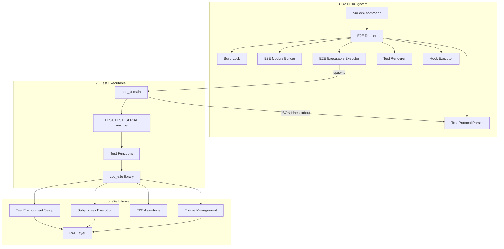

# Design Document: CDo E2E Framework

## Overview

This design introduces a dedicated end-to-end testing framework for CDo, consisting of three main deliverables:

1. **`MODULE_E2E`** — A new module kind (`e2e/`) recognized by the CDo build system, compiled into an executable that links against `cdo_ut` and `cdo_e2e`.
2. **`cdo_e2e` library crate** — A generic framework library providing test environment setup, subprocess execution, filesystem assertions, and fixture management.
3. **`cdo e2e` command** — A new top-level command that discovers, builds, and runs e2e test executables, parsing their JSON Lines protocol output and reporting aggregate results.

The design mirrors the existing `cdo test` / `MODULE_TST` / `cdo_ut` architecture, reusing the same test protocol, registration macros, and runner patterns. E2E tests differ from unit tests only in that they spawn subprocesses against isolated filesystem environments rather than testing in-process functions.

### Design Decisions

| Decision | Rationale |
|----------|-----------|
| Reuse `cdo_ut` for registration + protocol | Avoids duplicating test infrastructure; tooling (CI, renderer) works unchanged |
| `cdo_e2e` as a separate lib crate | Keeps e2e utilities decoupled from the build tool itself; any crate can use it |
| `e2e/fixtures/` excluded from compilation | Fixture directories contain TOML/source templates, not test code |
| Default 2-minute subprocess timeout | Prevents runaway processes from blocking CI indefinitely |
| `--keep-temps` opt-in preservation | Normal runs clean up; debugging requires explicit flag |
| Hooks reuse existing `HookDef`/`hook_execute` | Consistent hook behavior across build/test/e2e lifecycle points |

## Architecture



### Data Flow

1. User invokes `cdo e2e [<crate>] [options]`
2. `cmd_e2e` loads workspace, discovers crates with `MODULE_E2E` present
3. Workspace pre-e2e hook executes (if configured)
4. For each e2e crate (in workspace member order):
   a. Crate pre-e2e hook executes
   b. Build lock acquired → e2e module compiled + linked → lock released
   c. E2E executable spawned with forwarded `--filter`, `--jobs`, `--list`, `--timeout` args
   d. JSON Lines stdout parsed via `test_protocol_parse_line`
   e. Results accumulated into aggregate counters
   f. Crate post-e2e hook executes
5. Workspace post-e2e hook executes
6. Summary rendered; exit code determined (0/1/2)

## Components and Interfaces

### Component 1: Module System Extension (`MODULE_E2E`)

**Location:** `crates/cdo/api/model/module.h`, `crates/cdo/lib/model/`

Extends the `ModuleKind` enum with a new `MODULE_E2E` variant and updates the module count.

```c
typedef enum {
    MODULE_LIB,
    MODULE_EXE,
    MODULE_DYN,
    MODULE_TST,
    MODULE_API,
    MODULE_RES,
    MODULE_SHD,
    MODULE_E2E,     // NEW: e2e/ -> end-to-end test executable
} ModuleKind;

#define MODULE_KIND_COUNT 8
```

**Scanner changes:** `scanner_scan_modules` will detect the `e2e/` directory. `scanner_scan_module_sources` for `MODULE_E2E` will exclude the `e2e/fixtures/` subtree from source discovery.

**Artifact naming:** `module_artifact_name` for `MODULE_E2E` produces `<crate_name>_e2e.exe` (Windows) or `<crate_name>_e2e` (other platforms).

**Build exclusion:** `cmd_build` will NOT build `MODULE_E2E` unless explicitly requested via the `cdo e2e` command path. The `build_crate` dispatcher skips `MODULE_E2E` during normal builds.

### Component 2: E2E Module Builder (`build_e2e_module`)

**Location:** `crates/cdo/lib/commands/cmd_build_e2e.c`

Follows the same pattern as `build_test_module` in `cmd_build_test.c`:

```c
/// Build the E2E_Module for a crate: compile all .c/.cpp files in e2e/
/// (excluding e2e/fixtures/) into object files, then link against
/// cdo_ut + cdo_e2e + own lib + declared dependencies.
///
/// @param ws           The workspace
/// @param crate        The crate containing the e2e module
/// @param compiler     Detected compiler info
/// @param profile      Build profile name
/// @param build_prof   Build profile settings
/// @param jobs         Compilation parallelism
/// @param progress     Progress bar (may be NULL)
/// @param completed_units  Progress counter
/// @return 0 on success, non-zero on failure
int build_e2e_module(const Workspace* ws, Crate* crate,
                     const CompilerInfo* compiler,
                     const char* profile,
                     const BuildProfile* build_prof,
                     int jobs,
                     const CacheConfig* cache_config,
                     CacheStats* cache_stats,
                     bool no_cache,
                     CliProgressBar* progress,
                     int* completed_units);
```

**Key differences from `build_test_module`:**
- Excludes `e2e/fixtures/` from source scanning
- Implicitly links `cdo_ut` and `cdo_e2e` (even if not in crate.toml dependencies)
- Does NOT require `lib/` module in the same crate (e2e tests may test other crates' executables)
- Adds `CDO_TESTING` define (same as tst/)
- Deduplicates implicit deps if already declared in crate.toml

### Component 3: E2E Command (`cmd_e2e`)

**Location:** `crates/cdo/api/commands/cmd_e2e.h`, `crates/cdo/lib/commands/cmd_e2e.c`

```c
#ifndef CDO_COMMANDS_CMD_E2E_H
#define CDO_COMMANDS_CMD_E2E_H

#include "cmd/cli_cmd.h"

#ifdef __cplusplus
extern "C" {
#endif

/// Execute the e2e command.
/// Discovers crates with MODULE_E2E, builds and runs their e2e executables.
/// Supports --filter, --list, --release, --profile, --jobs, --verbose,
/// --timeout, --keep-temps, and positional crate name filtering.
/// Returns 0 if all tests passed, 1 if any failed, 2 on infrastructure error.
int cmd_e2e(const CliParseResult* result, void* ctx);

#ifdef __cplusplus
}
#endif

#endif // CDO_COMMANDS_CMD_E2E_H
```

**Arguments parsed from `CliParseResult`:**

| Argument | Type | Default | Description |
|----------|------|---------|-------------|
| `--filter <pattern>` | string | NULL | Substring filter forwarded to executable |
| `--list` | bool | false | List tests without executing |
| `--release` | bool | false | Use release profile |
| `--profile <name>` | string | NULL | Override profile (beats --release) |
| `--jobs <N>` | int | 0 (serial) | Parallel test execution (1-64) |
| `--verbose` | bool | false | Enable debug logging |
| `--timeout <seconds>` | int | 0 (no limit) | Per-test timeout in seconds |
| `--keep-temps` | bool | false | Preserve temp directories |
| positional | string[] | [] | Crate name filter |

**Forwarded to e2e executable as CLI args:** `--filter`, `--list`, `--jobs`, `--timeout`, `--keep-temps`

### Component 4: Hook System Extension

**Location:** `crates/cdo/api/model/hooks.h`

Extends `HookLifecycle` enum:

```c
typedef enum {
    HOOK_PRE_BUILD,
    HOOK_POST_BUILD,
    HOOK_PRE_TEST,
    HOOK_POST_TEST,
    HOOK_PRE_E2E,     // NEW
    HOOK_POST_E2E,    // NEW
} HookLifecycle;

#define HOOK_LIFECYCLE_COUNT 6
```

`hooks_parse_table` updated to recognize `"pre-e2e"` and `"post-e2e"` keys. The `HookSet.hooks[]` array grows from 4 to 6 entries.

### Component 5: `cdo_e2e` Library Crate

**Location:** `crates/cdo_e2e/`

```
crates/cdo_e2e/
├── crate.toml
├── api/
│   └── cdo_e2e.h              (public umbrella header)
├── lib/
│   ├── env/
│   │   ├── e2e_env.c          (test environment creation/destruction)
│   │   └── e2e_env.h          (internal header)
│   ├── spawn/
│   │   ├── e2e_spawn.c        (subprocess execution)
│   │   └── e2e_spawn.h        (internal header)
│   ├── assert/
│   │   ├── e2e_assert.c       (assertion helper implementations)
│   │   └── e2e_assert.h       (internal header)
│   └── fixture/
│       ├── e2e_fixture.c      (fixture copy logic)
│       └── e2e_fixture.h      (internal header)
└── tst/
    └── unit/
        ├── test_e2e_env.c
        ├── test_e2e_spawn.c
        ├── test_e2e_assert.c
        └── test_e2e_fixture.c
```

**`crate.toml`:**
```toml
[crate]
name = "cdo_e2e"
c-standard = 17

[dependencies]
cdo_ut = {}
```

## Data Models

### `E2eEnv` — Test Environment Context

```c
/// Maximum environment variable overrides per test environment.
#define E2E_ENV_MAX_VARS 64

/// Maximum arguments for subprocess invocation.
#define E2E_ENV_MAX_ARGS 128

/// A key-value pair for environment variable overrides.
typedef struct {
    char key[128];
    char value[512];
} E2eEnvVar;

/// Isolated test environment for a single e2e test.
typedef struct {
    char root_path[260];                 // Absolute path to temp directory
    char crate_path[260];                // Crate root (for fixture resolution)
    E2eEnvVar env_vars[E2E_ENV_MAX_VARS]; // Environment variable overrides
    int env_var_count;                   // Number of active overrides
    bool keep_temps;                     // If true, don't delete on cleanup
} E2eEnv;
```

### `E2eSpawnResult` — Subprocess Execution Result

```c
/// Result of spawning a subprocess within an E2E test environment.
typedef struct {
    int   exit_code;           // Process exit code
    char* stdout_buf;          // Captured stdout (heap-allocated, up to 16 MB)
    char* stderr_buf;          // Captured stderr (heap-allocated, up to 16 MB)
    bool  timed_out;           // True if process was terminated due to timeout
    char  error_desc[256];     // Error description if spawn failed
} E2eSpawnResult;
```

### `E2eSpawnOpts` — Subprocess Configuration

```c
/// Options for spawning a subprocess in an E2E test environment.
typedef struct {
    const char* executable;              // Path to executable
    const char* args[E2E_ENV_MAX_ARGS];  // Argument list
    int         arg_count;               // Number of arguments
    const char* working_dir;             // Override working directory (NULL = env root)
    int         timeout_ms;              // Timeout in ms (0 = use default 120000)
    E2eEnvVar*  extra_env;               // Additional env vars merged with E2eEnv's
    int         extra_env_count;         // Number of extra env vars
} E2eSpawnOpts;
```

## Public API (`cdo_e2e.h`)

```c
#ifndef CDO_E2E_H
#define CDO_E2E_H

#include <stddef.h>
#include <stdbool.h>
#include "cdo_ut.h"

#ifdef __cplusplus
extern "C" {
#endif

// --- Forward declarations (full definitions in internal headers) ---
typedef struct E2eEnv E2eEnv;
typedef struct E2eSpawnResult E2eSpawnResult;
typedef struct E2eSpawnOpts E2eSpawnOpts;

// ============================================================================
// Test Environment Setup (Requirement 4)
// ============================================================================

/// Create an isolated temporary directory for the test.
/// The directory name includes a sanitized test_name (up to 64 chars) and a unique suffix.
/// @param test_name  Human-readable name for the test (used in dir name)
/// @param env_out    Pointer to E2eEnv struct to initialize
/// @return 0 on success, non-zero error code on failure
int e2e_env_create(const char* test_name, E2eEnv* env_out);

/// Create a file within the test environment with given content.
/// Creates intermediate directories as needed.
/// Rejects paths that escape the environment root (e.g., containing ".." that resolves outside).
/// @param env         Active test environment
/// @param rel_path    Relative path within the environment
/// @param content     File content data
/// @param content_len Content length in bytes
/// @return 0 on success, non-zero error code on failure
int e2e_env_write_file(E2eEnv* env, const char* rel_path, const void* content, size_t content_len);

/// Create a directory within the test environment.
/// Creates intermediate directories as needed.
/// Rejects paths that escape the environment root.
/// @param env       Active test environment
/// @param rel_path  Relative path for the directory
/// @return 0 on success, non-zero error code on failure
int e2e_env_mkdir(E2eEnv* env, const char* rel_path);

/// Set an environment variable override for subprocesses spawned in this environment.
/// Does NOT modify the host process environment.
/// @param env    Active test environment
/// @param key    Variable name
/// @param value  Variable value
/// @return 0 on success, non-zero if limit reached
int e2e_env_setvar(E2eEnv* env, const char* key, const char* value);

/// Destroy the test environment: delete the temp directory and all contents recursively.
/// If env->keep_temps is true, logs the path and skips deletion.
/// @param env  Test environment to destroy
/// @return 0 on success, non-zero on failure (logged as warning, non-fatal)
int e2e_env_destroy(E2eEnv* env);

/// Set the crate root path used for fixture resolution.
/// Must be called before any e2e_fixture_copy operations.
/// @param env         Active test environment
/// @param crate_path  Absolute path to the crate root directory
/// @return 0 on success, non-zero if path is NULL or too long
int e2e_env_set_crate_path(E2eEnv* env, const char* crate_path);

// ============================================================================
// Subprocess Execution (Requirement 5)
// ============================================================================

/// Spawn a subprocess within the test environment context.
/// Merges environment variables from E2eEnv + opts->extra_env.
/// Captures stdout/stderr up to 16 MB each.
/// Applies timeout (default 120000ms if opts->timeout_ms == 0).
/// @param env     Active test environment
/// @param opts    Spawn configuration
/// @param result  Output spawn result (caller must free with e2e_spawn_result_free)
/// @return 0 on success (process ran, check result->exit_code), non-zero on spawn failure
int e2e_spawn(E2eEnv* env, const E2eSpawnOpts* opts, E2eSpawnResult* result);

/// Free resources associated with a spawn result (stdout_buf, stderr_buf).
/// @param result  Spawn result to free
void e2e_spawn_result_free(E2eSpawnResult* result);

// ============================================================================
// Fixture Management (Requirement 7)
// ============================================================================

/// Recursively copy a named fixture into the test environment.
/// Fixture is located at <crate_path>/e2e/fixtures/<fixture_name>/.
/// Reproduces all subdirectories and files with identical relative paths.
/// @param env           Active test environment (must have crate_path set)
/// @param fixture_name  Name of the fixture (alphanumeric, hyphens, underscores; max 64 chars)
/// @return 0 on success, non-zero on failure (missing fixture, copy error)
int e2e_fixture_copy(E2eEnv* env, const char* fixture_name);

// ============================================================================
// Assertions (Requirement 6)
// ============================================================================

/// Assert that spawn result exit code equals expected.
/// On failure: records via cdo_ut_record_failure and causes calling function to return 1.
#define E2E_ASSERT_EXIT_CODE(result, expected_code) \
    do { if ((result)->exit_code != (expected_code)) { \
        char _actual[32], _expected[32]; \
        snprintf(_actual, sizeof(_actual), "%d", (result)->exit_code); \
        snprintf(_expected, sizeof(_expected), "%d", (expected_code)); \
        cdo_ut_record_failure(__FILE__, __LINE__, "exit_code == " #expected_code, _actual, _expected); \
        return 1; \
    } } while(0)

/// Assert that spawn result stdout contains a substring (case-sensitive).
#define E2E_ASSERT_STDOUT_CONTAINS(result, substring) \
    do { \
        if ((result)->stdout_buf == NULL) { \
            cdo_ut_record_failure(__FILE__, __LINE__, "stdout contains " #substring, "(stdout not captured)", #substring); \
            return 1; \
        } \
        if (strstr((result)->stdout_buf, (substring)) == NULL) { \
            cdo_ut_record_failure(__FILE__, __LINE__, "stdout contains " #substring, (result)->stdout_buf, (substring)); \
            return 1; \
        } \
    } while(0)

/// Assert that spawn result stderr contains a substring (case-sensitive).
#define E2E_ASSERT_STDERR_CONTAINS(result, substring) \
    do { \
        if ((result)->stderr_buf == NULL) { \
            cdo_ut_record_failure(__FILE__, __LINE__, "stderr contains " #substring, "(stderr not captured)", #substring); \
            return 1; \
        } \
        if (strstr((result)->stderr_buf, (substring)) == NULL) { \
            cdo_ut_record_failure(__FILE__, __LINE__, "stderr contains " #substring, (result)->stderr_buf, (substring)); \
            return 1; \
        } \
    } while(0)

/// Assert that a file exists at the given absolute path.
#define E2E_ASSERT_FILE_EXISTS(path) \
    do { if (pal_path_exists(path) != 0) { \
        cdo_ut_record_failure(__FILE__, __LINE__, "file exists: " #path, "(not found)", (path)); \
        return 1; \
    } } while(0)

/// Assert that a file does NOT exist at the given absolute path.
#define E2E_ASSERT_FILE_NOT_EXISTS(path) \
    do { if (pal_path_exists(path) == 0) { \
        cdo_ut_record_failure(__FILE__, __LINE__, "file not exists: " #path, "(exists)", (path)); \
        return 1; \
    } } while(0)

/// Assert that a file's content contains a substring (case-sensitive).
/// Reads the file, searches for substring. Reports path on failure.
#define E2E_ASSERT_FILE_CONTAINS(filepath, substring) \
    do { \
        char* _fc_buf = NULL; size_t _fc_len = 0; \
        if (pal_file_read((filepath), &_fc_buf, &_fc_len) != 0) { \
            cdo_ut_record_failure(__FILE__, __LINE__, "file readable: " #filepath, "(read failed)", (filepath)); \
            return 1; \
        } \
        bool _fc_found = (strstr(_fc_buf, (substring)) != NULL); \
        free(_fc_buf); \
        if (!_fc_found) { \
            cdo_ut_record_failure(__FILE__, __LINE__, "file contains " #substring, (filepath), (substring)); \
            return 1; \
        } \
    } while(0)

#ifdef __cplusplus
}
#endif

#endif // CDO_E2E_H
```

## Error Handling

### Error Code Strategy

All `cdo_e2e` functions follow the PAL convention: return 0 on success, non-zero error code on failure.

| Error Code | Constant | Meaning |
|-----------|----------|---------|
| 0 | `E2E_OK` | Success |
| 1 | `E2E_ERR_IO` | Filesystem I/O failure |
| 2 | `E2E_ERR_TIMEOUT` | Subprocess timed out |
| 3 | `E2E_ERR_INVALID` | Invalid argument (NULL pointer, path escape, name too long) |
| 4 | `E2E_ERR_NOT_FOUND` | Fixture directory or file not found |
| 5 | `E2E_ERR_LIMIT` | Resource limit reached (max env vars, max args) |
| 6 | `E2E_ERR_SPAWN` | Subprocess could not be started |

### Error Propagation

- **Library functions** (`e2e_*`): Return error codes. Log at DEBUG or WARN level. Never abort.
- **Command (`cmd_e2e`)**: Logs at ERROR level on infrastructure failures. Continues to next crate on per-crate failures. Final exit code reflects worst outcome.
- **Hook failures**: Pre-e2e workspace hook failure aborts entire run (exit 2). Pre-e2e crate hook failure skips that crate. Post-e2e hook failures are logged as warnings only.
- **Path escape detection**: `e2e_env_write_file` and `e2e_env_mkdir` resolve the target path and verify it begins with `env->root_path`. Returns `E2E_ERR_INVALID` if the resolved path escapes.

### Logging

All logging uses the existing `cdo_log_*` macros from `core/log.h`:
- `cdo_log_error` — Build failures, missing dependencies, hook failures
- `cdo_log_warn` — Post-hook failures, temp directory cleanup failures
- `cdo_log_info` — Build progress, test execution start, summary
- `cdo_log_debug` — Argument forwarding, fixture resolution, spawn details

## Correctness Properties

*This project uses extensive unit testing rather than property-based testing (per project conventions). The properties below are formal invariants that the unit tests verify through concrete examples and edge cases. Each property states what must hold across all executions; the unit tests exercise representative inputs to confirm the invariant.*

### Property 1: Test Environment Isolation — Paths Never Escape Root

*For any* relative path passed to `e2e_env_write_file` or `e2e_env_mkdir`, the resolved absolute path SHALL always be a descendant of `env->root_path`. Any path containing `..` components or symlink indirection that resolves outside the root SHALL be rejected with `E2E_ERR_INVALID`.

**Validates: Requirements 4.7, 8.2**

### Property 2: Fixture Integrity — Original Fixtures Never Modified

*For any* call to `e2e_fixture_copy`, the original fixture directory at `<crate_path>/e2e/fixtures/<fixture_name>/` SHALL remain byte-for-byte identical after the copy completes. The operation is a pure read from the source and write to the Test_Environment; no write, rename, or delete operation SHALL target the fixture source tree.

**Validates: Requirements 7.3, 8.2**

### Property 3: Subprocess Timeout Enforcement

*For any* subprocess spawned via `e2e_spawn` with a timeout value T > 0, if the subprocess has not exited after T milliseconds, the framework SHALL terminate the process, set `result->timed_out = true`, and retain any stdout/stderr captured before termination. When no explicit timeout is provided, the default of 120 000 ms applies.

**Validates: Requirements 5.3, 5.4, 3.8**

### Property 4: Resource Cleanup — Temp Directories Deleted Unless `--keep-temps`

*For any* completed test (pass or fail), if `env->keep_temps` is false, `e2e_env_destroy` SHALL recursively delete the temporary directory and all its contents. If `env->keep_temps` is true, the directory SHALL be preserved and its path logged. Cleanup failure SHALL produce a warning but SHALL NOT fail the test.

**Validates: Requirements 8.6, 8.7, 8.8**

### Property 5: Protocol Correctness — Exit Codes Match Reported Failures

*For any* E2E_Module executable run, the process exit code SHALL be 0 if and only if the Test_Protocol `suite_end` message reports zero failures. Exit code 1 indicates one or more test failures matching the protocol count. If the executable exits non-zero without emitting a `suite_end` message, the E2E_Runner SHALL treat the run as a crash (infrastructure error).

**Validates: Requirements 9.6, 9.7, 2.7, 2.10**

### Property 6: Hook Ordering Guarantees

*For any* e2e run involving workspace and crate hooks, the execution order SHALL be: workspace `pre-e2e` → (for each crate in member order: crate `pre-e2e` → test execution → crate `post-e2e`) → workspace `post-e2e`. A workspace `pre-e2e` failure SHALL abort the entire run without executing any subsequent hooks or tests. A crate `pre-e2e` failure SHALL skip that crate's tests and `post-e2e` hook without affecting other crates.

**Validates: Requirements 11.5, 11.6, 11.7, 11.8**

## Testing Strategy

### Approach

Since the user has specified **no property-based testing**, the strategy uses extensive unit testing targeting >90% line coverage. Tests exercise the `cdo_e2e` library functions in isolation and test the command infrastructure through integration-style tests against real workspace fixtures.

### Unit Tests (`crates/cdo_e2e/tst/`)

| Test File | Coverage Target |
|-----------|----------------|
| `test_e2e_env.c` | `e2e_env_create`, `e2e_env_write_file`, `e2e_env_mkdir`, `e2e_env_setvar`, `e2e_env_destroy`, path escape rejection |
| `test_e2e_spawn.c` | `e2e_spawn` with mock executables, timeout behavior, env var merging, NULL buffer handling |
| `test_e2e_assert.c` | All assertion macros via controlled Spawn_Result structs and temp files |
| `test_e2e_fixture.c` | `e2e_fixture_copy` with real fixture trees, missing fixture, deep nesting, name validation |

### Unit Tests (`crates/cdo/tst/`)

| Test Area | Coverage Target |
|-----------|----------------|
| Module scanner e2e detection | `scanner_scan_modules` with e2e/ dir, fixtures exclusion, empty e2e/ |
| `module_artifact_name` for `MODULE_E2E` | Correct naming across platforms |
| Hook parsing for pre-e2e/post-e2e | `hooks_parse_table` with new lifecycle entries |
| `cmd_e2e` argument extraction | Filter, list, profile, jobs, timeout, keep-temps |

### E2E Tests (Self-hosting)

Once the framework is built, CDo will use it to test itself. E2E test workspaces go in `e2e/<workspace_name>/` and exercise the `cdo e2e` command itself (meta-testing).

### Test Execution

```bash
# Build and run cdo_e2e unit tests
.\cdo.exe test cdo_e2e

# Build and run cdo unit tests (includes module scanner + hook tests)
.\cdo.exe test cdo

# Run e2e tests once the framework is self-hosting
.\cdo.exe e2e cdo
```
