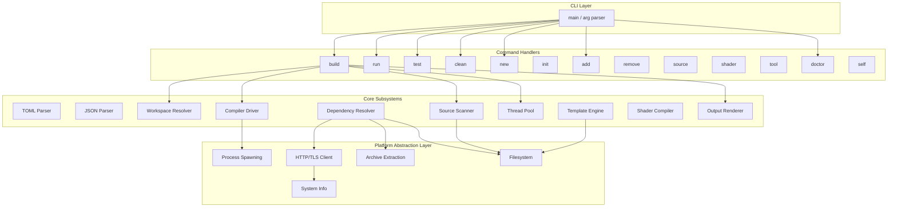
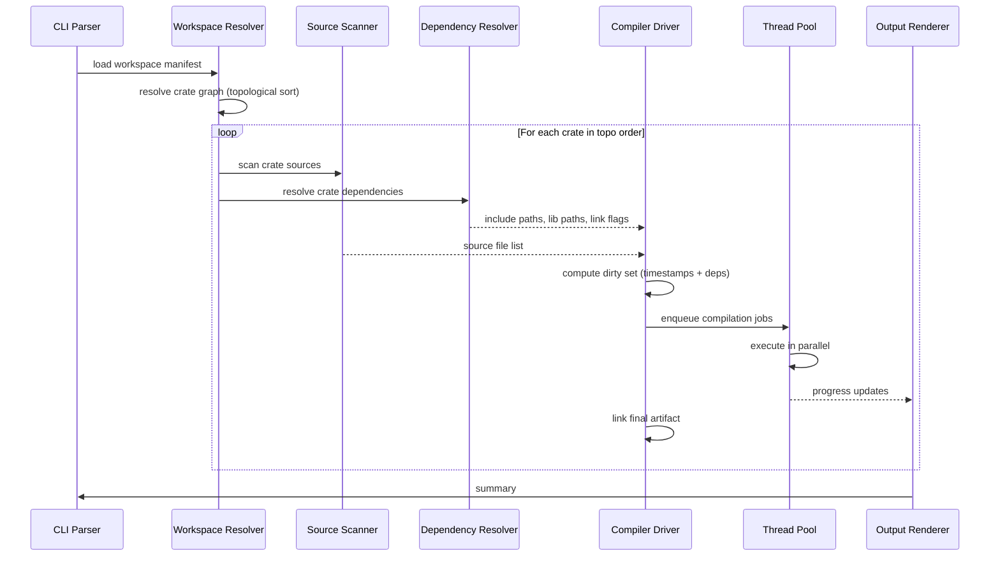

# Design Document: CDo Implementation

## Overview

CDo is a native C17 build management tool that replaces CMake and Ninja for C/C++ projects. It compiles as a single self-contained binary with no external library dependencies. The system owns the full build pipeline — from source detection and dependency resolution through compiler invocation and artifact linking.

The architecture follows a layered design: a thin CLI front-end dispatches to command handlers that orchestrate core subsystems (TOML parser, compiler driver, dependency resolver, HTTP client, archive extractor, template engine). Platform abstraction isolates OS-specific APIs behind a unified internal interface.

Key design goals:
- Sub-5ms startup via lazy initialization and zero heap allocation before argument parsing
- Parallel compilation via a work-stealing thread pool
- Cargo-inspired workspace/crate model with TOML-based manifests
- Fully embedded functionality (TOML, JSON, ZIP, tar.gz, HTTP/TLS, templates)

## Architecture



### Layered Architecture

1. **CLI Layer** — Zero-allocation argument parsing, command dispatch, global option extraction.
2. **Command Handlers** — Each subcommand is a function that orchestrates core subsystems. Stateless; receives a context struct with parsed options.
3. **Core Subsystems** — Reusable modules: parsers, compiler driver, resolver, thread pool, template engine, output renderer.
4. **Platform Abstraction Layer (PAL)** — Thin wrappers around OS-specific APIs. Each PAL module exposes a single header with platform-agnostic function signatures; the implementation file is selected at compile time via `#ifdef`.

### Data Flow: `cdo build`



## Components and Interfaces

### 1. CLI Parser (`cli.h`)

Parses `argv` into a command enum and an options struct. No heap allocation for the common path.

```c
typedef enum {
    CDO_CMD_BUILD,
    CDO_CMD_RUN,
    CDO_CMD_TEST,
    CDO_CMD_CLEAN,
    CDO_CMD_NEW,
    CDO_CMD_INIT,
    CDO_CMD_ADD,
    CDO_CMD_REMOVE,
    CDO_CMD_SOURCE,
    CDO_CMD_SHADER,
    CDO_CMD_TOOL,
    CDO_CMD_DOCTOR,
    CDO_CMD_SELF,
    CDO_CMD_HELP,
    CDO_CMD_UNKNOWN,
} CdoCommand;

typedef enum {
    CDO_COLOR_AUTO,
    CDO_COLOR_ALWAYS,
    CDO_COLOR_NEVER,
} CdoColorMode;

typedef enum {
    CDO_LOG_ERROR,
    CDO_LOG_WARN,
    CDO_LOG_INFO,
    CDO_LOG_DEBUG,
    CDO_LOG_TRACE,
} CdoLogLevel;

typedef struct {
    CdoCommand      command;
    CdoColorMode    color;
    CdoLogLevel     log_level;
    bool            verbose;
    bool            quiet;
    bool            help;
    bool            release;
    const char*     profile;
    int             jobs;           // 0 = auto-detect
    int             argc_rest;      // args after --
    const char**    argv_rest;
    int             positional_count;
    const char**    positional_args; // crate names, template name, etc.
} CdoOptions;

// Parse argv, populate opts. Returns 0 on success, non-zero on error.
int cdo_cli_parse(int argc, char** argv, CdoOptions* opts);

// Print usage for a given command (or general help if CDO_CMD_HELP).
void cdo_cli_print_help(CdoCommand cmd, FILE* out);

// Suggest similar commands for a typo. Returns number of suggestions written.
int cdo_cli_suggest(const char* input, char suggestions[][32], int max_suggestions);
```

### 2. TOML Parser (`toml.h`)

A hand-written recursive-descent parser for TOML v1.0. Produces an in-memory DOM (table/array/value tree). Supports serialization back to TOML text.

```c
typedef enum {
    TOML_STRING,
    TOML_INTEGER,
    TOML_FLOAT,
    TOML_BOOL,
    TOML_DATETIME,
    TOML_ARRAY,
    TOML_TABLE,
    TOML_INLINE_TABLE,
} TomlType;

typedef struct TomlValue TomlValue;
typedef struct TomlTable TomlTable;
typedef struct TomlArray TomlArray;

// Parse a TOML document from a UTF-8 string.
// On success, *out points to the root table. Caller frees with toml_free().
// On failure, returns non-zero and populates err with line/col/message.
typedef struct {
    int         line;
    int         col;
    char        message[256];
} TomlError;

int toml_parse(const char* input, size_t len, TomlTable** out, TomlError* err);

// Serialize a table back to TOML text.
int toml_serialize(const TomlTable* table, char** out_buf, size_t* out_len);

// Free a parsed TOML tree.
void toml_free(TomlTable* table);

// Lookup by dotted key path. Returns NULL if not found.
const TomlValue* toml_get(const TomlTable* table, const char* key_path);
```

### 3. JSON Parser (`json.h`)

Minimal JSON parser for legacy interop (dependency manifests, tool manifests).

```c
typedef enum {
    JSON_NULL,
    JSON_BOOL,
    JSON_NUMBER,
    JSON_STRING,
    JSON_ARRAY,
    JSON_OBJECT,
} JsonType;

typedef struct JsonValue JsonValue;

int json_parse(const char* input, size_t len, JsonValue** out, TomlError* err);
void json_free(JsonValue* val);
const JsonValue* json_get(const JsonValue* obj, const char* key);
```

### 4. Workspace Resolver (`workspace.h`)

Loads the workspace manifest, discovers crates, resolves dependencies, and produces a topologically sorted build order.

```c
typedef enum {
    CRATE_EXECUTABLE,
    CRATE_STATIC_LIB,
    CRATE_SHARED_LIB,
    CRATE_TEST,
} CrateType;

typedef struct {
    char            name[64];
    char            path[260];      // relative to workspace root
    CrateType       type;
    int             c_standard;     // 11, 17, 23
    int             cpp_standard;   // 17, 20, 23
    int             dep_count;
    int*            dep_indices;    // indices into workspace crate array
} Crate;

typedef struct {
    char            root_path[260];
    int             crate_count;
    Crate*          crates;         // topologically sorted
    int*            build_order;    // indices into crates[]
    int             build_order_count;
} Workspace;

// Load workspace from cdo.toml at the given root. Returns 0 on success.
int workspace_load(const char* root_path, Workspace* ws);

// Resolve the build order for all or specific crates. Returns 0 or error.
int workspace_resolve(Workspace* ws, const char** crate_names, int count);

// Free workspace resources.
void workspace_free(Workspace* ws);
```

### 5. Compiler Driver (`compiler.h`)

Detects the compiler, computes the dirty set, emits compile and link commands.

```c
typedef enum {
    COMPILER_GCC,
    COMPILER_CLANG,
    COMPILER_MSVC,
    COMPILER_UNKNOWN,
} CompilerFamily;

typedef struct {
    CompilerFamily  family;
    char            path[260];
    char            version[32];
    char            linker_path[260];
} CompilerInfo;

typedef struct {
    const char*     source_path;
    const char*     object_path;
    const char**    include_paths;
    int             include_path_count;
    const char**    defines;
    int             define_count;
    const char*     c_standard;     // "c17", "c11", etc.
    const char*     cpp_standard;   // "c++20", etc.
    const char**    extra_flags;
    int             extra_flag_count;
    bool            optimize;
    bool            debug_info;
} CompileJob;

typedef struct {
    const char**    object_paths;
    int             object_count;
    const char*     output_path;
    const char**    lib_paths;
    int             lib_path_count;
    const char**    link_libs;
    int             link_lib_count;
    bool            shared;
} LinkJob;

// Detect the system compiler. Returns 0 on success.
int compiler_detect(CompilerInfo* info);

// Compute which sources need recompilation. Returns array of dirty indices.
int compiler_compute_dirty(const Crate* crate, const char* build_dir,
                           int** dirty_indices, int* dirty_count);

// Execute a batch of compile jobs in parallel via thread pool.
int compiler_compile_batch(const CompileJob* jobs, int job_count,
                           const CompilerInfo* info, int parallelism);

// Link object files into final artifact.
int compiler_link(const LinkJob* job, const CompilerInfo* info);
```

### 6. Source Scanner (`scanner.h`)

Recursively discovers source files and headers within a crate's directory.

```c
typedef struct {
    char**  paths;
    int     count;
    int     capacity;
} FileList;

// Scan a crate's src/ directory for source files (.c, .cpp).
int scanner_scan_sources(const char* crate_path, const char** exclude_patterns,
                         int exclude_count, FileList* out);

// Scan a crate's include/ directory for headers (.h, .hpp).
int scanner_scan_headers(const char* crate_path, FileList* out);

void filelist_free(FileList* fl);
```

### 7. Thread Pool (`threadpool.h`)

Work-stealing thread pool for parallel compilation.

```c
typedef void (*TaskFunc)(void* arg);

typedef struct ThreadPool ThreadPool;

// Create a pool with n threads. If n == 0, use CPU core count.
ThreadPool* threadpool_create(int n);

// Submit a task. Returns a job ID.
int threadpool_submit(ThreadPool* pool, TaskFunc func, void* arg);

// Wait for all submitted tasks to complete. Returns 0 if all succeeded.
int threadpool_wait(ThreadPool* pool);

// Destroy the pool and free resources.
void threadpool_destroy(ThreadPool* pool);
```

### 8. Dependency Resolver (`deps.h`)

Resolves, fetches, and caches dependencies.

```c
typedef enum {
    DEP_REGISTRY,
    DEP_GIT,
    DEP_LOCAL,
} DepSourceKind;

typedef struct {
    char            name[64];
    char            version[32];
    DepSourceKind   source;
    char            url[512];       // registry URL, git URL, or local path
    char            git_ref[128];   // tag, branch, or commit (for git deps)
} DepSpec;

typedef struct {
    char            include_dir[260];
    char            lib_dir[260];
    char**          link_libs;
    int             link_lib_count;
    char**          runtime_dlls;
    int             runtime_dll_count;
} ResolvedDep;

// Resolve a dependency. Checks local cache first, downloads if needed.
int dep_resolve(const DepSpec* spec, const char* cache_dir, ResolvedDep* out);

// Generate or update the lock file.
int dep_lock_write(const char* lock_path, const DepSpec* specs, int count);

// Read the lock file. Returns specs array (caller frees).
int dep_lock_read(const char* lock_path, DepSpec** specs, int* count);
```

### 9. HTTP Client (`http.h`)

Platform-native HTTPS client with retry logic.

```c
typedef struct {
    int         status_code;
    char*       body;
    size_t      body_len;
    char*       error_msg;      // NULL on success
} HttpResponse;

typedef void (*HttpProgressFunc)(size_t downloaded, size_t total, void* ctx);

// Download a URL to a file. Retries up to max_retries with exponential backoff.
int http_download(const char* url, const char* dest_path,
                  int max_retries, HttpProgressFunc progress, void* ctx);

// Fetch a URL into memory (for small payloads like registry metadata).
int http_get(const char* url, HttpResponse* resp);

void http_response_free(HttpResponse* resp);
```

### 10. Archive Extractor (`archive.h`)

ZIP and tar.gz extraction.

```c
// Extract a ZIP archive to dest_dir. Preserves directory structure.
int archive_extract_zip(const char* archive_path, const char* dest_dir);

// Extract a tar.gz archive to dest_dir. Preserves directory structure and
// POSIX permissions on supported platforms.
int archive_extract_targz(const char* archive_path, const char* dest_dir);
```

### 11. Template Engine (`template.h`)

Variable substitution and conditional sections in template files.

```c
typedef struct {
    const char* key;
    const char* value;
} TemplateVar;

// Process a template string, performing variable substitution and conditional
// section evaluation. Output written to *out (caller frees).
int template_render(const char* input, size_t input_len,
                    const TemplateVar* vars, int var_count,
                    char** out, size_t* out_len);
```

### 12. Output Renderer (`output.h`)

Colored terminal output, progress bars, log-level filtering.

```c
// Initialize the output system. Detects TTY, sets color mode.
void output_init(CdoColorMode mode, CdoLogLevel level, bool is_tty);

// Log a message at the given level. Filtered by configured level.
void output_log(CdoLogLevel level, const char* fmt, ...);

// Convenience macros
#define cdo_error(fmt, ...) output_log(CDO_LOG_ERROR, fmt, ##__VA_ARGS__)
#define cdo_warn(fmt, ...)  output_log(CDO_LOG_WARN,  fmt, ##__VA_ARGS__)
#define cdo_info(fmt, ...)  output_log(CDO_LOG_INFO,  fmt, ##__VA_ARGS__)
#define cdo_debug(fmt, ...) output_log(CDO_LOG_DEBUG, fmt, ##__VA_ARGS__)
#define cdo_trace(fmt, ...) output_log(CDO_LOG_TRACE, fmt, ##__VA_ARGS__)

// Progress bar (for compilation, downloads).
typedef struct ProgressBar ProgressBar;
ProgressBar* progress_create(const char* label, int total);
void progress_update(ProgressBar* bar, int completed);
void progress_finish(ProgressBar* bar);
```

### 13. Platform Abstraction Layer (`pal.h`)

```c
// --- Process Spawning ---
typedef struct {
    const char*     program;
    const char**    args;
    int             arg_count;
    const char**    env;        // NULL = inherit
    const char*     cwd;        // NULL = inherit
    bool            capture_output;
} PalSpawnOpts;

typedef struct {
    int     exit_code;
    char*   stdout_buf;     // if captured
    char*   stderr_buf;     // if captured
} PalSpawnResult;

int pal_spawn(const PalSpawnOpts* opts, PalSpawnResult* result);
int pal_spawn_async(const PalSpawnOpts* opts, int* pid_out);
int pal_wait(int pid, int* exit_code);
void pal_spawn_result_free(PalSpawnResult* result);

// --- Filesystem ---
int pal_file_mtime(const char* path, uint64_t* mtime_ns);
int pal_dir_walk(const char* path, void(*callback)(const char* path, bool is_dir, void* ctx), void* ctx);
int pal_mkdir_p(const char* path);
int pal_rmdir_r(const char* path);
int pal_path_exists(const char* path);
int pal_file_read(const char* path, char** buf, size_t* len);
int pal_file_write(const char* path, const char* buf, size_t len);

// --- System Info ---
int pal_cpu_count(void);
int pal_get_home_dir(char* buf, size_t buf_size);
int pal_is_tty(int fd);

// --- Path Utilities ---
void pal_path_normalize(char* path);    // convert \ to / on Windows
int pal_path_join(char* dest, size_t dest_size, const char* base, const char* rel);
const char* pal_path_ext(const char* path);
```

## Data Models

### Workspace Manifest (`cdo.toml`)

```toml
[workspace]
members = ["crates/*"]

[workspace.settings]
c-standard = 17
cpp-standard = 20

[workspace.profiles.debug]
optimize = false
debug = true
defines = ["DEBUG"]

[workspace.profiles.release]
optimize = true
debug = false
defines = ["NDEBUG"]

[workspace.profiles.relwithdebinfo]
optimize = true
debug = true
defines = ["NDEBUG"]

[workspace.dependencies]
sdl3 = { version = "3.4.10", registry = "default" }
```

### Crate Manifest (`crate.toml`)

```toml
[crate]
name = "my-app"
type = "executable"
c-standard = 17
cpp-standard = 20

[dependencies]
sdl3 = { workspace = true }
my-lib = { path = "../my-lib" }

[build]
exclude = ["src/experimental/**"]
extra-flags = ["-Wall", "-Wextra"]
defines = ["APP_VERSION=\"1.0.0\""]
```

### Lock File (`cdo.lock`)

```toml
[[package]]
name = "sdl3"
version = "3.4.10"
source = "registry+https://registry.cdo.dev"
checksum = "sha256:abcdef1234567890..."

[[package]]
name = "imgui"
version = "1.90.4"
source = "git+https://github.com/ocornut/imgui#v1.90.4"
```

### Internal Data Structures

**Dependency Graph Node:**
```c
typedef struct {
    int         crate_index;
    int*        depends_on;     // indices of crates this depends on
    int         dep_count;
    int         in_degree;      // for topological sort
    bool        visited;
    bool        in_stack;       // for cycle detection
} DepGraphNode;
```

**Build State (incremental compilation):**
```c
typedef struct {
    char        source_path[260];
    uint64_t    source_mtime;
    uint64_t    object_mtime;
    char**      header_deps;    // from -MMD output
    int         header_dep_count;
    bool        needs_rebuild;
} BuildUnit;
```

**Tool Manifest (`cdo-tool.toml`):**
```toml
[tool]
name = "dxc"
version = "2026.05.27"
source = "https://github.com/microsoft/DirectXShaderCompiler/releases/..."

[tool.binaries]
windows = "bin/dxc.exe"
linux = "bin/dxc"
macos = "bin/dxc"
```


## Correctness Properties

*A property is a characteristic or behavior that should hold true across all valid executions of a system — essentially, a formal statement about what the system should do. Properties serve as the bridge between human-readable specifications and machine-verifiable correctness guarantees.*

### Property 1: TOML Round-Trip

*For any* valid TOML document (including those with UTF-8 string values, inline tables, arrays of tables, and datetime literals), parsing the document into an in-memory representation, serializing it back to TOML text, and parsing that text again SHALL produce an equivalent in-memory representation.

**Validates: Requirements 3.5, 3.4**

### Property 2: TOML Error Location Accuracy

*For any* valid TOML document that is corrupted by inserting, removing, or replacing a character at a random position, the parser SHALL report an error with a line number and column that corresponds to or is within one token of the corruption site.

**Validates: Requirements 3.3**

### Property 3: Topological Sort Ordering

*For any* valid directed acyclic graph of crate dependencies, the resolved build order SHALL satisfy the invariant that for every edge (A depends on B), B appears before A in the build order.

**Validates: Requirements 2.3**

### Property 4: Circular Dependency Detection

*For any* dependency graph that contains at least one cycle, the workspace resolver SHALL detect the cycle, report the participating crates, and refuse to produce a build order.

**Validates: Requirements 2.5**

### Property 5: Transitive Dependency Closure

*For any* subset of crates selected for building, the computed build set SHALL include all transitive dependencies of every selected crate — i.e., if crate A is selected and A depends on B which depends on C, then B and C are both in the build set.

**Validates: Requirements 4.2**

### Property 6: Timestamp-Based Dirty Set Correctness

*For any* set of source files and their corresponding object files with known modification timestamps, the dirty set computation SHALL mark a file as needing rebuild if and only if: (a) the source file's mtime is newer than the object file's mtime, (b) any header dependency's mtime is newer than the object file's mtime, or (c) the object file does not exist.

**Validates: Requirements 5.3, 9.1, 9.2, 9.3, 9.4**

### Property 7: Compiler Command Completeness

*For any* compile configuration (include paths, defines, flags, C/C++ standard, optimization level, debug info), the generated compiler command line SHALL contain every specified include path, every define, every extra flag, the correct standard flag, and the correct optimization/debug flags for the detected compiler family.

**Validates: Requirements 5.1, 22.1, 22.2, 22.3, 22.4**

### Property 8: CLI Suggestion Relevance

*For any* input string that does not match a known command, all suggested commands SHALL have an edit distance to the input that is less than or equal to a configured threshold, and at least one suggestion SHALL be returned if any command is within that threshold.

**Validates: Requirements 1.2**

### Property 9: Global Options Parsing

*For any* valid combination of global options (--verbose, --quiet, --log-level, --color, --help) combined with any valid command, the CLI parser SHALL correctly set all corresponding fields in the options struct without interfering with command-specific argument parsing.

**Validates: Requirements 1.3**

### Property 10: Source Scanner Completeness

*For any* directory tree rooted at a crate's `src/` directory, the source scanner SHALL discover every file with extension `.c`, `.cpp`, `.h`, or `.hpp` — the returned file list SHALL be a superset of all such files (minus those matching exclude patterns).

**Validates: Requirements 7.1**

### Property 11: Exclude Pattern Filtering

*For any* set of file paths and any set of glob exclude patterns, files matching at least one exclude pattern SHALL NOT appear in the scanner's output, and files matching no exclude pattern SHALL appear.

**Validates: Requirements 7.2**

### Property 12: Thread Pool Task Completion

*For any* set of N independent tasks submitted to the thread pool, after waiting for completion, exactly N tasks SHALL have executed and their results SHALL be available — no task is lost or executed more than once.

**Validates: Requirements 6.1**

### Property 13: Template Rendering Correctness

*For any* template string containing variable placeholders and conditional sections, and any set of variable bindings, the rendered output SHALL: (a) contain no unresolved placeholder markers, (b) include conditional sections whose condition variable is truthy, and (c) exclude conditional sections whose condition variable is falsy or undefined.

**Validates: Requirements 13.2, 13.3**

### Property 14: Lock File Round-Trip

*For any* set of resolved dependency specifications (name, version, source, checksum), writing the lock file and reading it back SHALL produce an equivalent set of specifications — no dependency is lost, added, or mutated.

**Validates: Requirements 11.5**

### Property 15: Path Normalization Idempotence

*For any* file path string (including mixed `/` and `\` separators on Windows), normalizing the path twice SHALL produce the same result as normalizing it once — i.e., normalization is idempotent: `normalize(normalize(p)) == normalize(p)`.

**Validates: Requirements 15.5**

### Property 16: Quiet Mode Filters Non-Errors

*For any* log message at a level other than ERROR, when quiet mode is active, the output renderer SHALL suppress the message. Only ERROR-level messages SHALL pass through.

**Validates: Requirements 14.3**

### Property 17: Retry Logic Correctness

*For any* sequence of download attempts where the first K attempts fail and attempt K+1 succeeds (K ≤ 3), the HTTP client SHALL make exactly K+1 attempts, apply exponential backoff between retries, and return success. If all 3 retries are exhausted, it SHALL return failure.

**Validates: Requirements 25.2**

### Property 18: Archive Structure Preservation

*For any* valid ZIP or tar.gz archive containing a directory tree, extraction SHALL reproduce the original directory structure — every file and directory present in the archive SHALL exist at the correct relative path under the destination directory.

**Validates: Requirements 19.1, 19.2, 19.3**

## Error Handling

### Strategy

CDo uses a consistent error handling pattern throughout:

1. **Return codes**: All internal functions return `int` (0 = success, non-zero = error category). No exceptions (C17).
2. **Error context struct**: Functions that can fail accept an optional error context pointer for detailed messages.
3. **Fail-fast for unrecoverable errors**: Circular dependencies, corrupted manifests, and internal errors terminate immediately with a diagnostic.
4. **Graceful degradation for recoverable errors**: Network failures retry, missing optional files are skipped with warnings, timestamp corruption triggers full rebuild.

### Error Categories

```c
typedef enum {
    CDO_OK = 0,
    CDO_ERR_IO,           // filesystem I/O failure
    CDO_ERR_PARSE,        // TOML/JSON/config syntax error
    CDO_ERR_RESOLVE,      // dependency resolution failure
    CDO_ERR_COMPILE,      // compiler returned non-zero
    CDO_ERR_LINK,         // linker returned non-zero
    CDO_ERR_NETWORK,      // HTTP/TLS failure
    CDO_ERR_ARCHIVE,      // corrupt or unsupported archive
    CDO_ERR_CYCLE,        // circular dependency
    CDO_ERR_NOT_FOUND,    // crate, file, or command not found
    CDO_ERR_INVALID_ARG,  // bad CLI argument or config value
    CDO_ERR_INTERNAL,     // bug in CDo itself
} CdoErrorCode;

typedef struct {
    CdoErrorCode    code;
    char            message[512];
    char            file[260];
    int             line;
    int             col;
} CdoError;
```

### Error Propagation Rules

| Subsystem | On Error | Behavior |
|-----------|----------|----------|
| CLI Parser | Invalid args | Print usage + error, exit non-zero |
| TOML Parser | Syntax error | Report file:line:col, abort command |
| Workspace Resolver | Cycle detected | Report cycle path, exit immediately |
| Compiler Driver | Compile error | Print compiler output, fail crate, continue others if multi-crate |
| Compiler Driver | Link error | Print linker output, fail crate |
| HTTP Client | Network error | Retry 3x with backoff, then fail with URL + status |
| Archive Extractor | Corrupt archive | Report file path, exit non-zero |
| Source Scanner | Permission denied | Warn and skip file, continue scanning |
| Thread Pool | Task panic | Capture error, mark task failed, complete remaining tasks |

### Compiler Error Enhancement

When a compiler error is detected, CDo scans the error text for common patterns and appends hints:

| Pattern | Hint |
|---------|------|
| `fatal error: *.h: No such file` | "Try: `cdo add <package>` or check include paths in crate.toml" |
| `undefined reference to` | "Missing library? Check [dependencies] in crate.toml" |
| `multiple definition of` | "Duplicate symbol — check for multiply-defined globals across translation units" |

## Testing Strategy

### Dual Testing Approach

CDo uses both example-based unit tests and property-based tests for comprehensive coverage:

**Unit Tests (example-based):**
- CLI command parsing (each command recognized)
- Config file precedence (.toml > .yaml > .json)
- Compiler family detection
- Specific error patterns and hints
- Crate type parsing
- --help output verification
- Doctor command checks

**Property-Based Tests:**
- TOML round-trip (Property 1)
- TOML error location (Property 2)
- Topological sort (Property 3)
- Cycle detection (Property 4)
- Transitive closure (Property 5)
- Dirty set computation (Property 6)
- Compiler command construction (Property 7)
- CLI suggestions (Property 8)
- Global options parsing (Property 9)
- Source scanner completeness (Property 10)
- Exclude pattern filtering (Property 11)
- Thread pool completion (Property 12)
- Template rendering (Property 13)
- Lock file round-trip (Property 14)
- Path normalization idempotence (Property 15)
- Quiet mode filtering (Property 16)
- Retry logic (Property 17)
- Archive structure preservation (Property 18)

**Integration Tests:**
- Full build cycle (workspace with multiple crates)
- Dependency download and wiring
- Process spawning and exit code propagation
- Archive extraction of real ZIP/tar.gz files
- Tool installation workflow
- Template instantiation from catalog

### Property-Based Testing Configuration

- **Library**: [theft](https://github.com/silentbicycle/theft) (C property-based testing library, single-header, no dependencies)
- **Iterations**: Minimum 100 per property, 1000 for parser round-trips
- **Tag format**: `/* Feature: cdo-implementation, Property N: <property text> */`
- Each correctness property maps to exactly one property-based test function
- Generators produce random valid inputs (TOML docs, DAGs, file trees, option combinations)

### Test Organization

```
tests/
├── unit/
│   ├── test_cli.c          // CLI parsing examples
│   ├── test_toml.c         // TOML conformance vectors
│   ├── test_json.c         // JSON parsing examples
│   ├── test_workspace.c    // Workspace loading examples
│   └── test_output.c       // Output formatting examples
├── property/
│   ├── prop_toml.c         // Properties 1, 2
│   ├── prop_graph.c        // Properties 3, 4, 5
│   ├── prop_compiler.c     // Properties 6, 7
│   ├── prop_cli.c          // Properties 8, 9
│   ├── prop_scanner.c      // Properties 10, 11
│   ├── prop_threadpool.c   // Property 12
│   ├── prop_template.c     // Property 13
│   ├── prop_lockfile.c     // Property 14
│   ├── prop_path.c         // Property 15
│   ├── prop_output.c       // Property 16
│   ├── prop_http.c         // Property 17
│   └── prop_archive.c      // Property 18
└── integration/
    ├── test_build_cycle.c
    ├── test_deps.c
    ├── test_process.c
    └── test_tools.c
```
