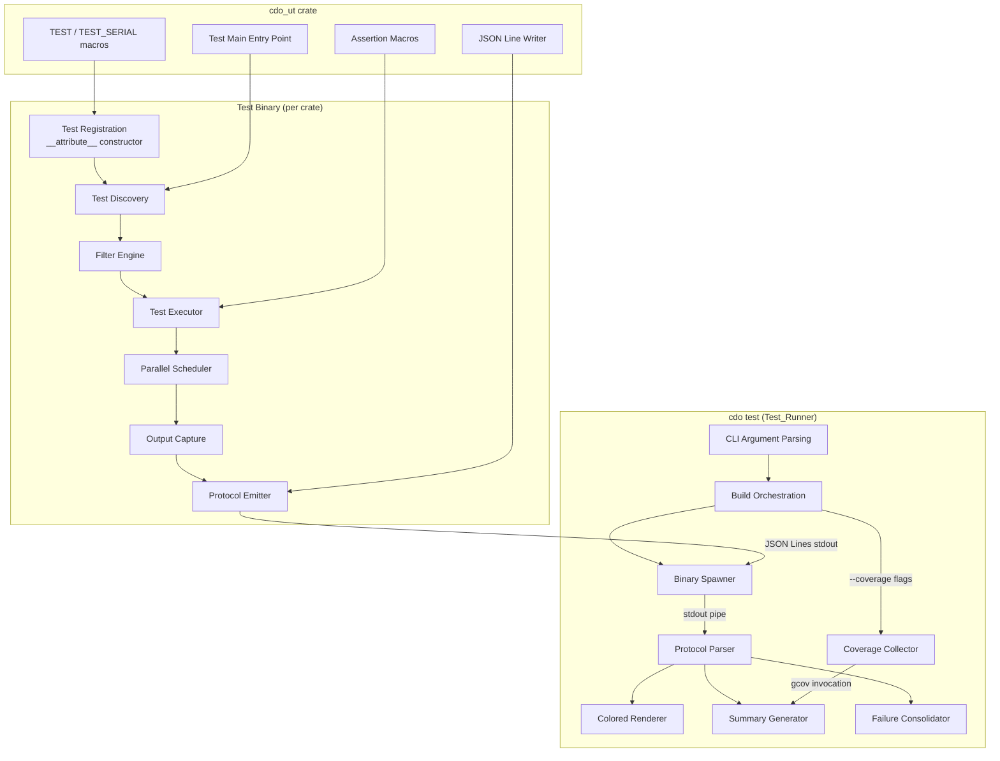

# Design Document: CDo Test Framework

## Overview

The CDo Test Framework introduces a dedicated `cdo_ut` crate providing unit test infrastructure, and enhances the existing `cdo test` command to produce rich, colored terminal output driven by a machine-readable JSON Lines protocol. The design separates concerns cleanly: the test binary (linked against `cdo_ut`) handles test discovery, execution, and structured output emission; the test runner (`cdo test` in the `cdo` crate) handles binary orchestration, protocol parsing, colored rendering, filtering delegation, coverage integration, and summary generation.

This design builds on the existing test infrastructure patterns (the `TEST()` macro with `__attribute__((constructor))`, the `register_test` function, assertion macros) while factoring them into a reusable crate and adding structured reporting.

### Key Design Decisions

1. **Separate crate (`cdo_ut`)** rather than inline headers — enables any future crate to depend on the test framework consistently, with its own `crate.toml` and build integration.
2. **JSON Lines protocol on stdout** — simple, line-oriented, parseable without buffering entire output. Each line is a self-contained JSON object.
3. **Process-per-crate execution model** — the runner spawns one test binary per crate. Parallelism within a crate is handled by the binary itself via threads.
4. **Coverage via GCC `--coverage` flags + gcov** — leverages the existing w64devkit GCC 13.x toolchain rather than introducing external coverage tools.

## Architecture



### Data Flow

1. User invokes `cdo test [--filter X] [--coverage] [--jobs N] [--list]`
2. Runner parses CLI args, builds test binaries (with coverage flags if requested)
3. Runner spawns each test binary with forwarded arguments (`--filter`, `--list`, `--jobs`)
4. Binary discovers registered tests via the global registry populated by constructors
5. Binary applies filter, then executes tests (sequentially or in parallel)
6. Binary emits JSON Lines protocol messages on stdout
7. Runner reads stdout line-by-line, parses JSON, renders colored output
8. After all binaries complete, runner displays summary and consolidated failure list
9. If `--coverage`, runner invokes gcov and appends coverage data to summary

## Components and Interfaces

### cdo_ut Crate (`crates/cdo_ut/`)

#### Directory Layout

```
crates/cdo_ut/
├── crate.toml
├── api/
│   └── cdo_ut.h          # Public header consumed by test modules
├── lib/
│   ├── cdo_ut_main.c     # Test main() with discovery, filtering, execution
│   ├── cdo_ut_protocol.c # JSON Lines emitter
│   ├── cdo_ut_filter.c   # Substring and glob filter matching
│   ├── cdo_ut_parallel.c # Thread-based parallel executor
│   └── cdo_ut_capture.c  # Per-test stdout/stderr capture
└── tst/                   # (optional) Self-tests for the framework
```

#### Public API (`cdo_ut.h`)

```c
#ifndef CDO_UT_H
#define CDO_UT_H

#include <stdio.h>
#include <stdlib.h>
#include <string.h>
#include <stdbool.h>

#ifdef __cplusplus
extern "C" {
#endif

/*--- Test Registration ---*/

extern void cdo_ut_register(const char *name, int (*func)(void), bool serial);

#define TEST(test_name)                                                \
    static int test_name##_impl(void);                                 \
    static void __attribute__((constructor)) test_name##_ctor(void) {  \
        cdo_ut_register(#test_name, test_name##_impl, false);          \
    }                                                                  \
    static int test_name##_impl(void)

#define TEST_SERIAL(test_name)                                         \
    static int test_name##_impl(void);                                 \
    static void __attribute__((constructor)) test_name##_ctor(void) {  \
        cdo_ut_register(#test_name, test_name##_impl, true);           \
    }                                                                  \
    static int test_name##_impl(void)

/* MSVC fallback */
#ifdef _MSC_VER
#undef TEST
#undef TEST_SERIAL
#define TEST(test_name) static int test_name##_impl(void)
#define TEST_SERIAL(test_name) static int test_name##_impl(void)
#define REGISTER_TEST(test_name) cdo_ut_register(#test_name, test_name##_impl, false)
#define REGISTER_TEST_SERIAL(test_name) cdo_ut_register(#test_name, test_name##_impl, true)
#endif

/*--- Assertion Macros ---*/

// Internal failure recording (defined in cdo_ut_main.c)
extern void cdo_ut_record_failure(const char *file, int line,
                                   const char *expr,
                                   const char *actual, const char *expected);

#define TEST_ASSERT(cond)                                              \
    do { if (!(cond)) {                                                \
        cdo_ut_record_failure(__FILE__, __LINE__, #cond, NULL, NULL);   \
        return 1;                                                      \
    } } while(0)

#define TEST_ASSERT_EQ(a, b)                                           \
    do { if ((a) != (b)) {                                             \
        char _a_buf[64], _b_buf[64];                                   \
        snprintf(_a_buf, sizeof(_a_buf), "%lld", (long long)(a));      \
        snprintf(_b_buf, sizeof(_b_buf), "%lld", (long long)(b));      \
        cdo_ut_record_failure(__FILE__, __LINE__, #a " == " #b,        \
                              _a_buf, _b_buf);                         \
        return 1;                                                      \
    } } while(0)

#define TEST_ASSERT_NEQ(a, b)                                          \
    do { if ((a) == (b)) {                                             \
        char _a_buf[64];                                               \
        snprintf(_a_buf, sizeof(_a_buf), "%lld", (long long)(a));      \
        cdo_ut_record_failure(__FILE__, __LINE__, #a " != " #b,        \
                              _a_buf, _a_buf);                         \
        return 1;                                                      \
    } } while(0)

#define TEST_ASSERT_STR_EQ(a, b)                                       \
    do { if (strcmp((a), (b)) != 0) {                                   \
        cdo_ut_record_failure(__FILE__, __LINE__, #a " streq " #b,     \
                              (a), (b));                                \
        return 1;                                                      \
    } } while(0)

#define TEST_ASSERT_NULL(ptr)                                           \
    do { if ((ptr) != NULL) {                                           \
        cdo_ut_record_failure(__FILE__, __LINE__, #ptr " == NULL",      \
                              "(non-null)", "NULL");                    \
        return 1;                                                      \
    } } while(0)

/*--- Test Main (provided by cdo_ut, linked into test binary) ---*/

// The test binary's main() is provided by cdo_ut_main.c.
// It handles: --list, --filter, --jobs, discovery, execution, and protocol output.
// Crate test files just include cdo_ut.h and define TEST() functions.

#ifdef __cplusplus
}
#endif

#endif // CDO_UT_H
```

### Structured Protocol (JSON Lines)

Each message is a single JSON object on one line of stdout. All strings use ASCII-safe encoding (non-ASCII characters are `\uXXXX` escaped).

#### Message Types

```jsonc
// suite_start — emitted once at beginning
{"type": "suite_start", "total": 47}

// test_start — emitted when a test begins
{"type": "test_start", "name": "test_toml_parse_basic", "id": 0}

// test_end — emitted when a test completes
{"type": "test_end", "name": "test_toml_parse_basic", "id": 0,
 "status": "pass", "duration_ms": 2.31}

// test_end with failure
{"type": "test_end", "name": "test_toml_roundtrip", "id": 1,
 "status": "fail", "duration_ms": 5.12,
 "failure": {"file": "tst/unit/test_toml.c", "line": 42,
             "expr": "a == b", "actual": "3", "expected": "5"}}

// test_end with skip
{"type": "test_end", "name": "test_serial_file_io", "id": 2,
 "status": "skip", "duration_ms": 0.0}

// suite_end — emitted once at end
{"type": "suite_end", "total": 47, "passed": 45, "failed": 1,
 "skipped": 1, "duration_ms": 123.45}

// error — emitted on fatal initialization errors
{"type": "error", "message": "Failed to allocate test registry"}
```

#### Protocol Invariants

- One JSON object per line (no multi-line objects)
- Every message has a `"type"` field
- Messages appear in order: `suite_start`, then interleaved `test_start`/`test_end` pairs, then `suite_end`
- In parallel mode, `test_start`/`test_end` pairs may interleave across tests but each pair shares the same `id`
- `suite_end.total == suite_end.passed + suite_end.failed + suite_end.skipped`

### Test Runner (`cdo test` command)

The test runner lives in the existing `cdo` crate under `lib/commands/`. It orchestrates:

1. **Building** — invokes the build system for each crate's `tst/` module, producing a test binary
2. **Spawning** — executes each test binary as a child process, piping stdout
3. **Parsing** — reads JSON Lines from the pipe, deserializes using the existing `json.h` API
4. **Rendering** — produces colored terminal output using the existing `output.h` infrastructure
5. **Summarizing** — aggregates results across crates
6. **Coverage** — if `--coverage`, compiles with coverage flags and runs gcov post-execution

#### Key Functions

```c
// In lib/commands/cmd_test.c
int cmd_test_run(const CdoOptions *opts, const Workspace *ws);

// In lib/commands/test_protocol.c
typedef struct {
    char name[256];
    int  id;
    enum { TEST_PASS, TEST_FAIL, TEST_SKIP } status;
    double duration_ms;
    struct {
        char file[256];
        int  line;
        char expr[256];
        char actual[128];
        char expected[128];
    } failure;
} TestResult;

int  test_protocol_parse_line(const char *line, TestResult *out);
void test_renderer_result(const TestResult *result, bool use_color);
void test_renderer_summary(int total, int passed, int failed, int skipped,
                           double duration_ms, double coverage_pct,
                           bool use_color);
void test_renderer_failures(const TestResult *failures, int count, bool use_color);
```

### Filter Engine (`cdo_ut_filter.c`)

```c
// Returns true if test_name matches the filter pattern.
// If pattern contains '*', treats as glob. Otherwise, substring match.
bool cdo_ut_filter_matches(const char *test_name, const char *pattern);
```

The filter uses a simple algorithm:
- If pattern contains no `*`: `strstr(test_name, pattern) != NULL`
- If pattern contains `*`: recursive glob match where `*` matches zero or more characters

### Parallel Executor (`cdo_ut_parallel.c`)

```c
// Execute tests in parallel using the existing threadpool.
// serial_tests are run after all parallel tests complete.
void cdo_ut_run_parallel(int jobs, TestEntry *tests, int count,
                          TestEntry *serial_tests, int serial_count);
```

Each parallel test:
1. Redirects its stdout/stderr to a per-test buffer (pipe or temp file)
2. Executes the test function
3. Stores the result and captured output
4. Emits the protocol messages in a serialized manner (mutex-protected)

### Coverage Collector

```c
// In lib/commands/cmd_test.c
typedef struct {
    char file[256];
    int  lines_total;
    int  lines_hit;
    double pct;
} FileCoverage;

int  coverage_run_gcov(const char *build_dir, FileCoverage *out, int max_files);
double coverage_aggregate(const FileCoverage *files, int count);
```

## Data Models

### Test Registry (in cdo_ut)

```c
#define CDO_UT_MAX_TESTS 1024

typedef struct {
    const char *name;
    int (*func)(void);
    bool serial;  // true = must run sequentially
} CdoUtTestEntry;

// Global registry populated by constructors before main()
static CdoUtTestEntry g_ut_tests[CDO_UT_MAX_TESTS];
static int g_ut_test_count = 0;
```

### Test Result (in runner)

```c
typedef struct {
    char        crate_name[64];
    char        test_name[256];
    int         test_id;
    enum { TR_PASS, TR_FAIL, TR_SKIP } status;
    double      duration_ms;
    // Failure details (only valid when status == TR_FAIL)
    char        fail_file[256];
    int         fail_line;
    char        fail_expr[256];
    char        fail_actual[128];
    char        fail_expected[128];
} RunnerTestResult;
```

### Coverage Data

```c
typedef struct {
    char   file_path[256];
    int    lines_total;
    int    lines_hit;
} CoverageFileEntry;

typedef struct {
    CoverageFileEntry files[256];
    int               file_count;
    double            aggregate_pct;  // sum(hits) / sum(totals) * 100
} CoverageReport;
```

## Correctness Properties

*A property is a characteristic or behavior that should hold true across all valid executions of a system — essentially, a formal statement about what the system should do. Properties serve as the bridge between human-readable specifications and machine-verifiable correctness guarantees.*

### Property 1: Test Registration Discovery

*For any* set of N functions registered via the `TEST()` macro, when the test binary is invoked with `--list`, it SHALL output exactly those N test names (one per line) and no others.

**Validates: Requirements 1.3, 6.2**

### Property 2: Assertion Correctness

*For any* pair of integer values (a, b), `TEST_ASSERT_EQ(a, b)` SHALL pass (return 0) if and only if `a == b`, and SHALL fail (return 1) otherwise. Similarly, *for any* pair of strings (s1, s2), `TEST_ASSERT_STR_EQ(s1, s2)` SHALL pass if and only if `strcmp(s1, s2) == 0`.

**Validates: Requirements 1.4**

### Property 3: Failure Metadata Recording

*For any* assertion failure occurring at a known file path and line number with given expression and values, the recorded failure SHALL contain that exact file path, line number, expression text, and the actual and expected value strings.

**Validates: Requirements 1.5**

### Property 4: Protocol Message Validity

*For any* protocol message emitted by the test binary, it SHALL be a single line containing valid JSON with a `"type"` field whose value is one of `suite_start`, `test_start`, `test_end`, `suite_end`, or `error`. No line SHALL contain characters outside the ASCII range (0x00–0x7F).

**Validates: Requirements 2.5, 9.4**

### Property 5: Protocol Count Consistency

*For any* completed test run emitting a `suite_end` message, the invariant `passed + failed + skipped == total` SHALL hold, and `total` SHALL equal the count reported in the initial `suite_start` message.

**Validates: Requirements 2.4**

### Property 6: Result Rendering Correctness

*For any* test result with a given name and status, the renderer SHALL produce output containing the test name prefixed with a green checkmark (✓) if status is pass, or a red cross (✗) if status is fail. When status is fail, failure details SHALL appear indented below the test name.

**Validates: Requirements 3.1, 3.2**

### Property 7: Progress Display Accuracy

*For any* pair (completed, total) where `0 <= completed <= total` and `total > 0`, the progress display SHALL contain the string representation `[completed/total]`.

**Validates: Requirements 3.3**

### Property 8: ANSI-Free Output in Non-Color Mode

*For any* test output rendered with color mode disabled (non-ANSI terminal), the output string SHALL contain no bytes matching the escape character `0x1B`.

**Validates: Requirements 3.4**

### Property 9: Summary Color Reflects Status

*For any* set of test results where at least one test has status `fail`, the summary SHALL be rendered with red ANSI color codes. *For any* set of test results where all tests pass, the summary SHALL be rendered with green ANSI color codes.

**Validates: Requirements 4.3, 4.4**

### Property 10: Failures Section Presence

*For any* set of test results, a "Failures:" section SHALL appear in the output if and only if at least one test has status `fail`. When present, every failed test SHALL appear in the section. When absent (all pass), the string "Failures:" SHALL not appear.

**Validates: Requirements 5.1, 5.3**

### Property 11: Failure Listing Completeness

*For any* failed test result with known crate name, test name, file path, and line number, the "Failures:" section SHALL contain all four of those values for that test.

**Validates: Requirements 5.2**

### Property 12: Substring Filter Correctness

*For any* set of test names and a filter pattern containing no `*` character, the test binary SHALL execute exactly those tests whose names contain the pattern as a substring (case-sensitive).

**Validates: Requirements 7.2**

### Property 13: Glob Filter Correctness

*For any* set of test names and a filter pattern containing `*` characters, the test binary SHALL execute exactly those tests whose names match the glob pattern, where `*` matches zero or more characters.

**Validates: Requirements 7.3**

### Property 14: List With Filter Intersection

*For any* set of registered test names and a filter pattern, invoking the binary with `--list --filter <pattern>` SHALL output exactly the names that match the filter, and no others.

**Validates: Requirements 6.3**

### Property 15: gcov Output Parsing

*For any* valid gcov output containing per-file coverage lines (format: `File 'path'` followed by `Lines executed:XX.XX% of N`), the parser SHALL extract the correct file path, percentage, and line count for each file.

**Validates: Requirements 8.3**

### Property 16: Aggregate Coverage Computation

*For any* set of per-file coverage data `{(lines_hit_i, lines_total_i)}`, the aggregate coverage percentage SHALL equal `(sum(lines_hit) / sum(lines_total)) * 100`. When `sum(lines_total) == 0`, coverage SHALL be reported as 0%.

**Validates: Requirements 8.4**

### Property 17: Parallel Output Isolation

*For any* set of tests executing in parallel where each test produces a unique output string, no test's captured output SHALL contain content from another test's output.

**Validates: Requirements 10.3**

### Property 18: Serial Test Exclusivity

*For any* test registered with `TEST_SERIAL()`, it SHALL never execute concurrently with any other test. Serial tests SHALL run only after all parallel tests have completed.

**Validates: Requirements 10.5**

## Error Handling

| Error Condition | Handler | Behavior |
|----------------|---------|----------|
| Test registry overflow (> CDO_UT_MAX_TESTS) | `cdo_ut_register()` | Emit `{"type": "error", "message": "..."}` and `exit(1)` |
| Invalid JSON line from test binary | Protocol parser | Log warning, skip line, continue |
| Test binary crashes (non-zero exit, no `suite_end`) | Runner | Report all unfinished tests as failed, display error |
| Test binary not found / build failure | Runner | Report build error for that crate, continue with others |
| `--coverage` but gcov not in PATH | Coverage collector | Print error message, exit with non-zero code |
| Filter matches zero tests | Test binary | Emit `suite_end` with `total: 0`, exit with code 0 |
| Thread creation failure in parallel mode | Parallel executor | Fall back to sequential execution, log warning |
| Pipe creation failure for output capture | Parallel executor | Emit protocol error message, exit(1) |
| Memory allocation failure in assertion macro | Assertion macros | Treated as test failure with best-effort metadata |

### Exit Codes

| Code | Meaning |
|------|---------|
| 0 | All tests passed (or zero tests matched filter) |
| 1 | At least one test failed |
| 2 | Infrastructure error (build failure, gcov missing, etc.) |

## Testing Strategy

### Property-Based Testing

The feature is well-suited for property-based testing. The core logic modules (filter engine, protocol emitter/parser, renderer, coverage parser) are pure functions with clear input/output behavior and large input spaces.

**Library:** [theft](https://github.com/silentbicycle/theft) (already vendored in the project at `crates/cdo/tst/vendor/theft.h`)

**Configuration:**
- Minimum 100 trials per property test
- Each property test tagged with: `Feature: cdo-test-framework, Property N: <text>`

**Property tests to implement:**
- Properties 1–18 as defined in Correctness Properties above
- Focus on pure-function modules: `cdo_ut_filter.c`, `cdo_ut_protocol.c`, `test_protocol.c` (parser), renderer functions, coverage parser

### Unit Tests (Example-Based)

| Area | Tests |
|------|-------|
| CLI integration | `--list` prints grouped test names; `--filter` + `--list` combination |
| Coverage integration | gcov invocation with mock .gcda files |
| Terminal detection | Mocked TTY vs non-TTY paths |
| MSVC fallback | Manual registration path compiles and discovers tests |
| Crate grouping | Results from multiple crates display with headers |

### Integration Tests

| Area | Tests |
|------|-------|
| End-to-end run | Build `cdo_ut` self-tests, run binary, verify protocol output |
| Coverage end-to-end | Build with `--coverage`, run, verify gcov output and summary |
| Parallel execution | Run with `--jobs 4`, verify correct results and no interleaving |
| Error scenarios | Binary crash, build failure, gcov missing |

### Test Organization

Tests for the `cdo_ut` crate itself live in `crates/cdo_ut/tst/`. Tests for the runner logic live in `crates/cdo/tst/unit/` (extending the existing test suite). Property-based tests use the vendored `theft` library already available in the project.
