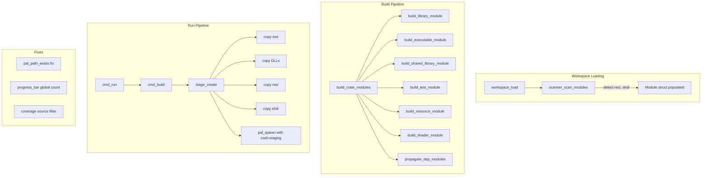

# Design Document: Crate Modules

## Overview

This feature extends CDo's module system with two new non-compiled module kinds (`res` and `shd`), enhances the `cdo run` command with a staging folder that mirrors real deployment conditions, removes the standalone `cdo shader` command in favor of build-integrated shader compilation, and addresses three cross-cutting fixes (PAL return codes, progress bar accuracy, coverage filtering).

The design builds on the existing module infrastructure (`ModuleKind` enum, `Module` struct, `scanner_scan_modules`, `build_crate_modules` orchestrator) and extends it with asset-handling capabilities. The key architectural insight is that `res` and `shd` modules follow the same lifecycle as compiled modules (detect → process → output to build dir) but replace compilation with file-copy and DXC-invocation respectively.

## Architecture



### Build Order for Modules Within a Crate

The existing `build_crate_modules` orchestrator already enforces: lib → exe/dyn/tst. The new modules fit into this as:

1. **lib/** (static library) — built first, all others depend on it
2. **shd/** (shader compilation) — can run in parallel with lib, but sequenced after for simplicity
3. **res/** (resource copy) — no dependencies, can run anytime
4. **exe/** / **dyn/** / **tst/** — built after lib, linked against it

For simplicity, the order within `build_crate_modules` will be: `lib → shd → res → exe → dyn → tst`. Shaders before resources because compiled shaders may be placed into `res/` by convention (though this feature doesn't enforce that pattern).

### Inter-Crate Dependency Propagation

After building all modules of a dependency crate, the dependent crate receives:
- `api/` → include path (existing behavior)
- `lib` → link artifact (existing behavior)
- `dyn` → linker search path + DLL copy to build dir (new)
- `res/` → files copied from dep's `build/<profile>/<dep>/res/` → `build/<profile>/<crate>/res/` (new)
- `shd/` → files copied from dep's `build/<profile>/<dep>/shd/` → `build/<profile>/<crate>/shd/` (new)

Transitive propagation follows the existing BFS in `workspace_resolve`.

## Components and Interfaces

### New/Modified Headers

#### `core/module.h` — Extended ModuleKind enum

```c
typedef enum {
    MODULE_LIB,     // lib/ -> static library (.a / .lib)
    MODULE_EXE,     // exe/ -> executable
    MODULE_DYN,     // dyn/ -> shared library (.dll / .so)
    MODULE_TST,     // tst/ -> test executable
    MODULE_API,     // api/ -> header-only (no compilation)
    MODULE_RES,     // res/ -> resource files (copy only)
    MODULE_SHD,     // shd/ -> shader sources (compiled to .dxil)
} ModuleKind;

#define MODULE_KIND_COUNT 7
```

#### `core/workspace.h` — Expanded Crate struct

```c
typedef struct Crate {
    // ... existing fields ...
    Module          modules[7];     // indexed by ModuleKind (was 5)
    int             module_count;   // number of present modules (1-7)
    bool            has_lib;
    bool            has_api;
    bool            has_res;        // NEW: shortcut for modules[MODULE_RES].present
    bool            has_shd;        // NEW: shortcut for modules[MODULE_SHD].present
    // ... rest unchanged ...
} Crate;
```

#### `commands/cmd_build_internal.h` — New build functions

```c
/// Build (copy) the Resource_Module for a crate.
/// Performs incremental copy from res/ to build/<profile>/<crate>/res/.
/// Removes stale files not present in source.
int build_resource_module(const Workspace* ws, Crate* crate,
                          const char* profile,
                          ProgressBar* progress,
                          int* completed_units);

/// Build (compile) the Shader_Module for a crate using DXC.
/// Performs incremental compilation of .hlsl → .dxil.
int build_shader_module(const Workspace* ws, Crate* crate,
                        const char* profile,
                        const BuildProfile* build_prof,
                        bool force,
                        ProgressBar* progress,
                        int* completed_units);

/// Propagate dependency module outputs (res, shd, dyn) into the
/// dependent crate's build directory. Detects conflicts.
int propagate_dep_modules(const Workspace* ws, Crate* crate,
                          const char* profile);
```

#### `commands/test_coverage.h` — Filter parameter

```c
/// Run gcov and filter results to workspace sources only.
/// ws_root: workspace root path for source filtering.
/// Only files under <ws_root>/crates/ are included.
int coverage_run_gcov_filtered(const char *build_dir, const char *ws_root,
                               FileCoverage *out, int max_files);
```

### Modified Components

| Component | Change |
|-----------|--------|
| `scanner_scan_modules` | Detect `res/` and `shd/` directories, populate MODULE_RES/MODULE_SHD |
| `build_crate_modules` | Call `build_resource_module` and `build_shader_module` in order |
| `cmd_run` | Create staging folder at `.cdo/<crate>/run/`, populate, spawn with cwd |
| `cmd_build` (progress) | Pre-count total units globally before building; include shd files in count |
| `test_coverage.c` | Add path filtering against `<ws_root>/crates/` prefix |
| `pal_fs.c` | Fix `pal_path_exists` return codes on both platforms |
| `cli.h` / CLI dispatch | Remove `CDO_CMD_SHADER`, add deprecation message |

## Data Models

### Module struct (extended for res/shd)

The existing `Module` struct already has `kind`, `dir_path`, `sources` (FileList), `artifact_path`, and `present`. For `res` and `shd` modules:

- **MODULE_RES**: `sources` contains all files (not just `.c/.cpp`). `artifact_path` is the output directory (`build/<profile>/<crate>/res/`). No compilation occurs.
- **MODULE_SHD**: `sources` contains `.hlsl` files. `artifact_path` is the output directory (`build/<profile>/<crate>/shd/`). DXC compilation produces `.dxil` files.

### Staging Folder Layout

```
.cdo/<crate>/run/
├── <crate>.exe          # or <crate> on Linux
├── dep1.dll             # shared library deps
├── dep2.dll
├── res/                 # resource files (flat merge of crate + deps)
│   ├── config.toml
│   └── assets/
│       └── texture.png
└── shd/                 # compiled shaders (flat merge of crate + deps)
    ├── vertex.dxil
    └── pixel.dxil
```

### Build Output Layout (per crate)

```
build/<profile>/<crate>/
├── lib/                 # object files for lib module
├── exe/                 # object files for exe module
├── dyn/                 # object files for dyn module
├── tst/                 # object files for tst module
├── res/                 # copied resource files
│   └── <relative_path>
├── shd/                 # compiled shader outputs
│   └── <relative_path>.dxil
├── <crate>.exe          # exe artifact
├── lib<crate>.a         # lib artifact
└── <crate>.dll          # dyn artifact
```

### Progress Bar Counting

The total unit count is computed as:
- For each crate in build order: count `.c`, `.cpp`, `.cxx`, `.cc` files across all compiled modules (lib, exe, dyn, tst)
- Shader files (`.hlsl`) are NOT counted in the progress bar (they compile via DXC, not GCC)
- Resource files are NOT counted (copy is near-instant)

When a module is fully up-to-date (all objects newer than sources), the crate's file count is added to `completed_units` immediately without recompilation.

## Error Handling

| Scenario | Behavior |
|----------|----------|
| `res/` file copy fails (permission, disk full) | Log error with source path + reason, return non-zero from `build_resource_module` |
| Stale file removal fails | Log warning, continue (non-fatal) |
| DXC not installed | Error: "DXC not found at .cdo/tools/dxc/bin/dxc.exe. Try: cdo tool install dxc", return 1 |
| Single shader fails | Log DXC stderr, continue compiling remaining shaders, return non-zero after all processed |
| Dep conflict (same relative path in res/shd from two deps) | Error listing both source crates and conflicting path, return 1 |
| Circular dependency | Detected by existing `workspace_resolve`, error with cycle crate names |
| `cdo run` on non-exe crate | Error: "crate '<name>' has no executable target" |
| Staging folder cleanup fails | Log warning, attempt to continue |
| `pal_path_exists` with NULL | Return `PAL_ERR_NOT_FOUND` (9) |
| Coverage: all files filtered | Report 0% coverage, display no per-file entries |

## Correctness Properties

This feature does not use property-based testing. The project's development methodology explicitly requires "No PBT" and instead mandates extensive unit testing targeting >90% line coverage on all touched source files. The feature involves filesystem operations (file copying, directory walking), external tool invocation (DXC), and build system orchestration — all areas where example-based unit tests and integration tests provide more practical value than property-based approaches.

## Testing Strategy

Per the project's development rules, **property-based testing is not used**. The testing approach is extensive unit testing targeting >90% line coverage.

### Unit Tests

| Area | Test Cases |
|------|-----------|
| **Resource Module** | Detection of `res/` dir; incremental copy (newer/older/missing); stale removal; empty dir; filesystem error simulation |
| **Shader Module** | Detection of `shd/` dir; incremental compilation; force recompile; DXC missing; DXC failure; empty dir; nested dirs |
| **Inter-Crate Deps** | Res propagation; shd propagation; dyn propagation; transitive deps; conflict detection; cycle detection |
| **Run Command** | Staging folder creation; exe copy; DLL copy; res copy; shd copy; argv forwarding; prior run cleanup; non-exe crate error; build failure handling |
| **PAL path_exists** | NULL input; empty string; existing file; existing dir; non-existent path; both platforms |
| **Progress Bar** | Global count across crates; single crate targeting; up-to-date skip; zero sources; mid-build error |
| **Coverage Filter** | Workspace-local files included; external files excluded; path normalization; all-excluded case; case sensitivity (platform-dependent) |
| **Shader Removal** | `cdo shader` prints deprecation; help output excludes shader |

### Integration/E2E Tests

Create test workspaces in `e2e/` directory:
- `e2e/res_module/` — workspace with a crate containing `res/` files
- `e2e/shd_module/` — workspace with a crate containing `shd/` files and DXC available
- `e2e/dep_propagation/` — multi-crate workspace testing res/shd/dyn propagation
- `e2e/run_staging/` — workspace testing `cdo run` staging folder behavior

### Test File Organization

```
crates/cdo/tst/unit/
├── test_build_resource.c    # Resource module build logic
├── test_build_shader.c      # Shader module build logic
├── test_dep_propagation.c   # Inter-crate module dependency propagation
├── test_run_staging.c       # Run command staging logic
├── test_pal_path_exists.c   # PAL fix verification
├── test_progress_global.c   # Progress bar global counting
├── test_coverage_filter.c   # Coverage source filtering
└── test_shader_removal.c    # Shader command removal verification
```
