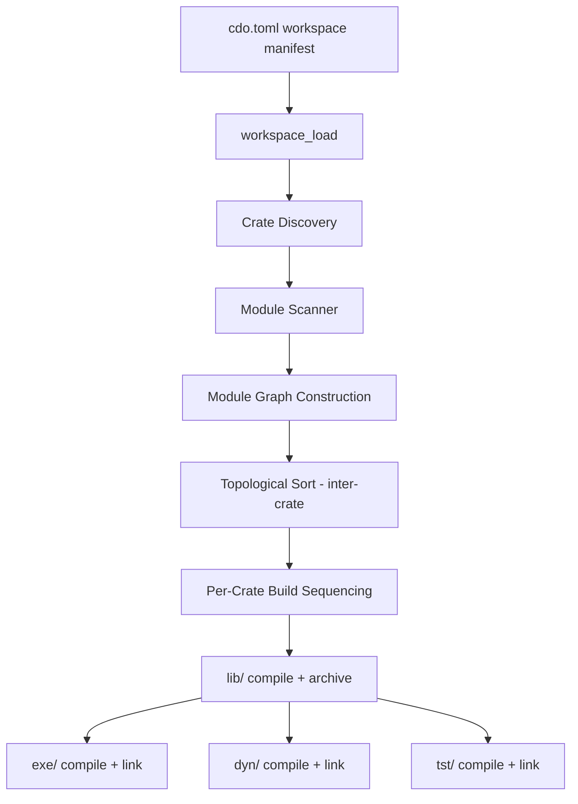
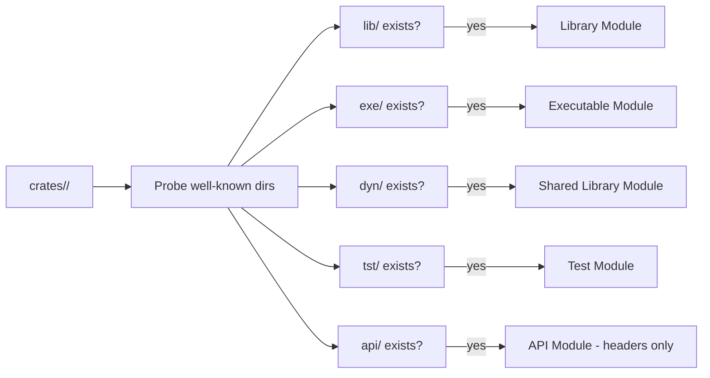
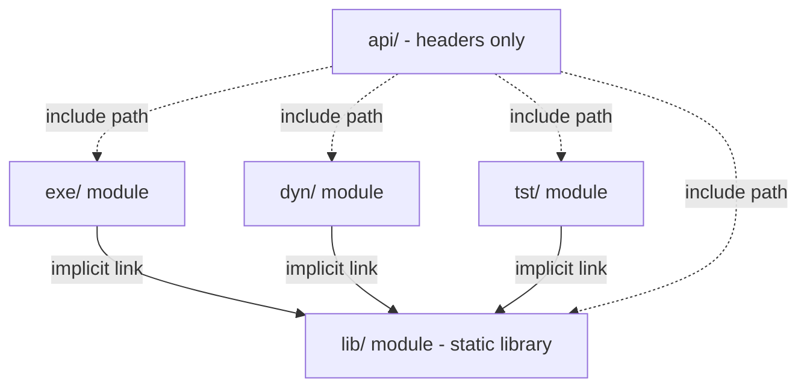

# Design Document: Multi-Module Crates

## Overview

This design extends CDo's build model from "one crate = one artifact" to "one crate = N modules, each producing a distinct artifact." A crate directory may contain any combination of well-known module subdirectories (`lib/`, `exe/`, `dyn/`, `tst/`, `api/`), each discovered automatically by the scanner without explicit manifest declarations.

The core motivation is eliminating the current coupling problem: test crates must depend on executable crates and recompile all sources with test defines. With multi-module crates, the `lib/` module holds core logic as a static library, while `exe/`, `dyn/`, and `tst/` modules link against it implicitly — giving clean separation without source duplication.

### Key Design Decisions

1. **Convention over configuration**: Module types are derived purely from directory presence, not manifest fields.
2. **Implicit intra-crate dependency**: Non-library modules automatically depend on their crate's `lib/` module without manifest declaration.
3. **Library-only inter-crate linking**: External crates can only depend on a target crate's `lib/` module, never on `exe/` or other modules.
4. **Backward compatibility**: Existing `src/`-based crates and `include/` directories still work via graceful fallback.

## Architecture

### High-Level Build Pipeline



### Module Discovery Flow



### Intra-Crate Dependency Model



## Components and Interfaces

### New Data Structures

#### ModuleKind Enum

Replaces the flat `CrateType` for intra-crate module identification:

```c
typedef enum {
    MODULE_LIB,     // lib/ → static library (.a / .lib)
    MODULE_EXE,     // exe/ → executable
    MODULE_DYN,     // dyn/ → shared library (.dll / .so)
    MODULE_TST,     // tst/ → test executable
    MODULE_API,     // api/ → header-only (no compilation)
} ModuleKind;
```

#### Module Struct

Represents a single build module within a crate:

```c
typedef struct {
    ModuleKind      kind;
    char            dir_path[260];      // absolute path to module directory
    FileList        sources;            // discovered .c/.cpp files (empty for API)
    char            artifact_path[260]; // output artifact path
    bool            present;            // true if directory exists
} Module;
```

#### Updated Crate Struct

The `Crate` struct gains a modules array replacing the single `type` field:

```c
typedef struct {
    char            name[64];
    char            path[260];
    int             c_standard;
    int             cpp_standard;

    // Module layout (replaces CrateType)
    Module          modules[5];         // indexed by ModuleKind
    int             module_count;       // number of present modules (1-5)
    bool            has_lib;            // shortcut: modules[MODULE_LIB].present
    bool            has_api;            // shortcut: modules[MODULE_API].present

    // Dependencies (unchanged)
    int             dep_count;
    int*            dep_indices;
    int             dev_dep_count;
    int*            dev_dep_indices;
    char**          link_libs;
    int             link_lib_count;
    char**          defines;
    int             define_count;
} Crate;
```

### Scanner Changes

The scanner API is extended with a new entry point for module-aware scanning:

```c
/// Scan a crate directory for module subdirectories and their source files.
/// Populates the crate's modules[] array based on which well-known
/// directories (lib/, exe/, dyn/, tst/, api/) exist.
/// Returns 0 on success, non-zero on error (e.g., no modules found).
int scanner_scan_modules(const char* crate_path, Crate* crate,
                         const char** exclude_patterns, int exclude_count);

/// Scan a single module directory for source files recursively.
/// For MODULE_API, only scans for headers.
/// Returns 0 on success, non-zero on error.
int scanner_scan_module_sources(const char* module_dir, ModuleKind kind,
                                const char** exclude_patterns,
                                int exclude_count, FileList* out);
```

The existing `scanner_scan_sources()` and `scanner_scan_headers()` functions remain for backward compatibility but internally delegate to the module-aware scanner when module directories are detected.

### Compiler/Linker Changes

The build command gains module-aware logic:

```c
/// Build all modules within a crate in dependency order.
/// Compiles lib/ first, then exe/, dyn/, tst/ in parallel.
/// Returns 0 on success, non-zero if any module fails.
int build_crate_modules(const Workspace* ws, const Crate* crate,
                        const CompilerInfo* compiler, const BuildProfile* profile,
                        int parallelism);

/// Compute include paths for a given module, considering implicit
/// dependencies on the crate's lib/ and api/ modules.
/// Returns allocated array of include path strings (caller frees).
int module_include_paths(const Crate* crate, ModuleKind kind,
                         const Workspace* ws, char*** paths, int* count);
```

### Workspace Changes

```c
/// Resolve inter-crate dependencies, validating that target crates
/// have a Library_Module. Returns 0 on success.
int workspace_resolve_module_deps(Workspace* ws);
```

### Include Path Resolution Table

| Module Being Compiled | Include Paths Added                                      |
|-----------------------|----------------------------------------------------------|
| `lib/`                | `lib/`, `api/` (if present)                              |
| `exe/`               | `exe/`, `lib/`, `api/` (if present)                      |
| `dyn/`               | `dyn/`, `lib/`, `api/` (if present)                      |
| `tst/`               | `tst/`, `lib/`, `api/` (if present)                      |
| External crate       | Target crate's `api/` (or fallback `include/`)           |

### Build Order Rules

1. **Intra-crate**: `lib/` always compiles first. `exe/`, `dyn/`, `tst/` compile after `lib/` succeeds (can be parallel).
2. **Inter-crate**: Topological sort on crate dependency graph. All modules of crate N complete before crate N+1 starts.
3. **Failure propagation**: If `lib/` fails, all dependent modules in that crate are skipped.

## Data Models

### Crate Directory Layout (New Convention)

```
crates/<crate_name>/
├── crate.toml          # manifest (type field now optional/ignored)
├── api/                # public headers (optional)
│   └── <crate_name>/
│       └── *.h
├── lib/                # core library sources (optional but required for exe/dyn/tst)
│   └── *.c / *.cpp
├── exe/                # executable entry point (optional)
│   └── main.c
├── dyn/                # shared library wrapper (optional)
│   └── exports.c
└── tst/                # test sources (optional)
    └── test_*.c
```

### Artifact Output Layout

```
build/<profile>/<crate_name>/
├── lib/
│   ├── *.o             # object files from lib/ sources
├── exe/
│   ├── *.o             # object files from exe/ sources
├── dyn/
│   ├── *.o             # object files from dyn/ sources
└── tst/
│   ├── *.o             # object files from tst/ sources
├── <crate_name>.exe / <crate_name>
├── <crate_name>.lib / lib<crate_name>.a
├── <crate_name>.dll / lib<crate_name>.so
└── <crate_name>_test.exe / <crate_name>_test
```

### Crate Manifest (`crate.toml`) Changes

The `type` field becomes optional and ignored. Module types are inferred from directory structure:

```toml
[crate]
name = "mycrate"
# type = "executable"   ← ignored if present
c-standard = 17

[dependencies]
some_lib = {}

[build]
link-libs = ["pthread"]
defines = ["MY_DEFINE"]
```

All manifest settings (`c-standard`, `cpp-standard`, `[dependencies]`, `[build]`) apply uniformly to every module in the crate.

### Inter-Crate Dependency Resolution

When Crate A depends on Crate B:
- Crate B must have a `lib/` module (error otherwise)
- All of Crate A's modules link against Crate B's static library artifact
- Crate A's modules get Crate B's `api/` (or fallback `include/`) added to their include paths
- Transitive dependencies are resolved: if B depends on C, A also links against C's library

### Backward Compatibility

| Current Layout | Behavior |
|---|---|
| `src/` only, `type = "executable"` | Scanner finds no module dirs → error. User must migrate to `lib/` + `exe/` or just `exe/`. |
| `include/` directory | Falls back as public include path if no `api/` dir exists |
| `type` field in manifest | Silently ignored; modules inferred from dirs |

